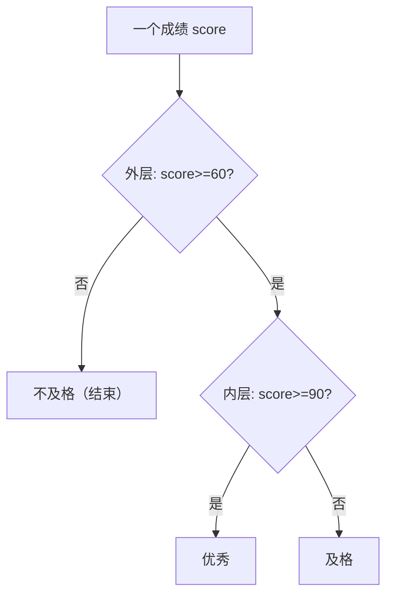

<!-- 片头 · 空镜 -->
## C 用 {} 抱团，Python 靠"缩进"当家

---
layout: cover
---

# 第6讲 · 条件结构
## 给程序开岔路

<!-- 讲者备注：【空镜】开场钩子。抛"你已经会 C 的 if/else,Python 最大的差别是什么"——不是关键字,是界定块的方式:{} vs 缩进。本讲要把三种分支、缩进即块、嵌套分层、elif 隐含条件一次讲清。节奏:先认识三种 if,再谈为什么缩进是命根,最后用比大小、成绩等级把判断写顺手,顺手收掉 elif 的坑。 -->

---
transition: slide-left
---

# 这一讲，你会收获四件事

- 三种分支：`if`、`if-else`、`if-elif-else`
- 缩进即块：4 空格当家的 Python
- 嵌套分层：外层抓大类，内层做细分
- 省心条件：`elif` 的隐含条件

<!-- 讲者备注：【全景】抛路线图,只给骨架不展开。"判断帮你开岔路"是本讲心智模型。教学目标:学完能写单/双/多条件三种分支;会用 elif 处理多分支并理解隐含条件;能靠缩进组织嵌套分支;独立完成比大小与成绩等级两个实验。 -->

---
layout: section
---

## 第一幕 · 三种分支

<!-- 转场
讲者备注：【转场】幕卡,淡入切幕。一句话预告本幕:不管多复杂的选择,拆到底都是 if / if-else / if-elif-else 三种骨架。先逐个认清,再谈怎么用。 -->

---

# 一条岔路：if

```python
age = 20
if age >= 18:
    print("成年")      # 缩进的这行属于 if 块
```

> 条件为真，才走这条岔路

<!-- 讲者备注：【全景】单条件分支就是唯一岔路:条件成立才进块。这里把"缩进决定归属"第一次点出来——提醒同学看 print 前的那 4 个空格。慢讲,这是后面一切的基石。 -->

---

# 两条岔路：if-else

```python
n = -5
if n >= 0:
    print("非负数")
else:                # else 条件 = if 不成立，不用再写判断
    print("负数")
```

> else 不需要条件：非真即走 else

<!-- 讲者备注：【全景】if-else 是"二选一"。关键一句:else 不用写条件,因为它的条件就是"if 不成立"。C 里也是 else,但 Python 少了 {},改靠缩进对齐。 -->

---

# 多条岔路：if-elif-else

```python
score = 85
if score >= 90:
    grade = "优秀"
elif score >= 80:
    grade = "良好"
elif score >= 70:
    grade = "中等"
elif score >= 60:
    grade = "及格"
else:
    grade = "不及格"
print(grade)      # 输出：良好
```

<!-- 讲者备注：【全景】多条件分支:从上到下依次判断,命中第一个成立就停。抓两个字:elif 是 Python 的连写,不是 C 的 else if。这页是成绩等级的原型,第三幕还要拿它开刀讲隐含条件。 -->

---
layout: section
---

## 第二幕 · 缩进与嵌套

<!-- 转场
讲者备注：【转场】幕卡,淡入切幕。一句话预告本幕:三种骨架会画了,但真实世界不止一层岔路。缩进是命根,嵌套是层次——这幕把"怎么组织层次"讲透。 -->

---

# 缩进，就是 Python 的代码块

```text
if 条件:
    缩进的语句 ……   # 属于 if 块
    缩进的语句 ……   # 仍属于 if 块
不缩进的语句 ……      # 已离开 if 块
```

- 块内统一 **4 个空格**，别混用 Tab
- 错了 = `IndentationError`，或**逻辑错位**（不报错但结果错，更危险）

<!-- 讲者备注：【特写】命根中的命根。C 用 {} 抱团,Python 用缩进分出亲疏。两个坏后果:报 IndentationError、或更隐蔽的逻辑错位。让学生找一个"看起来对但缩进掉出 if 的 bug",体会逻辑错位的危险。 -->

---

# 层次怎么定？外层抓大类，内层做细分



<!-- 讲者备注：【全景】先立原则再给图:真实选择是多层的,层次要这样定——外面先问"大类"(及格吗),里面再问"细分"(够上优秀吗)。这张决策树就是嵌套规则的具象。 -->

---

# 嵌套：外层抓大类，内层细分

```python
score = 88
if score >= 60:            # 外层：抓大类
    if score >= 90:        #   内层：细分
        grade = "优秀"
    elif score >= 80:
        grade = "良好"
    else:
        grade = "及格"
else:
    grade = "不及格"
print(grade)     # 输出：良好
```

<!-- 讲者备注：【特写】嵌套写法落地。外 if 先定"及格否",里 if 再定"优秀/良好/及格"。每层 +4 空格。层次顺序口诀:先定外层大条件,逐层往里细化。让同学数一数这里有几层缩进。 -->

---
layout: section
---

## 第三幕 · elif 隐含条件 · 上手实验

<!-- 转场
讲者备注：【转场】幕卡,淡入切幕。一句话预告本幕:判断会写了,但 elif 有个隐藏的"免费午餐"——它自带前置不成立的隐含条件。这幕把它点破,再用比大小、成绩等级两个实验把判断写熟。 -->

---

# ⚠️ 别把 elif 当独立 if：隐含条件

```python
if score >= 90:
    grade = "优秀"
elif score >= 60 and score < 90:   # ❌ 多写了 score >= 60
    grade = "及格"
```

自 `if` 之后，每个 `elif` 已隐含"前面都不成立"：

```python
elif score >= 80:    # 到这里已隐含 score < 90
elif score >= 60:    # 隐含 score < 80
```

<!-- 讲者备注：【难点】全讲最容易混的坑。前半段抛错版本:多写前置条件,逻辑对但冗余易错。后半段点破:elif 自带隐含条件,只写本层条件即可。这是 elif 省代码、清爽的根本原因。教学:先让同学找这段错代码"多写了什么",再揭晓。 -->

---

# 实验1：比大小

```python
a = int(input("请输入a："))
b = int(input("请输入b："))
if a > b:
    print(f"{a} > {b}")
elif a == b:
    print(f"{a} == {b}")
else:
    print(f"{a} < {b}")
```

<!-- 讲者备注：【特写】第一个上手实验:三个分支各当一态——大于、等于、小于。测试三组:(5,8)、(8,8)、(9,2),三种都应输出正确。一句话点醒输入是逐行读入,正好对应三态判断。 -->

---

# 实验2：成绩等级自动判定

```python
score = int(input("请输入成绩（0-100）："))
if score >= 90:
    grade = "优秀"
elif score >= 80:
    grade = "良好"
elif score >= 70:
    grade = "中等"
elif score >= 60:
    grade = "及格"
else:
    grade = "不及格"
print(f"等级：{grade}")
```

<!-- 讲者备注：【特写】第二个上手实验:if-elif-else 的完整应用。强调边界值思维:恰好 90、89、60、59 分别输出什么?这是"设计测试用例验证两端取值"的表率。 -->

---

# 五个坑，踩一个算我输

| 想干嘛 | 坑 | 对的做法 |
|---|---|---|
| 缩进分组 | Tab/空格混用 | 统一 4 空格 |
| 判断归属 | 该缩进的行掉出 if 块 | 检查缩进层级 |
| 多分支 | `elif` 又写前置条件 | 依赖隐含条件 |
| 多分支 | 用 `else if` | Python 用 `elif` |
| 取舍边界 | `>=` 与 `>` 用错 | 测两端取值 |

<!-- 讲者备注：【全景】五个真实坑速查:缩进混用、逻辑错位、elif 重复写前置、把 else if 当 elif、边界符号用错。每个都能先让学生猜,再给正解。这是报错与口糊的高发区。 -->

---

# 结课：判断帮你开岔路

> 单条件 `if`、双条件 `if-else`、
> 多条件 `elif` 连起来——
> 外层抓大类，内层做细分，缩进是命根。

🔜 下节预告：循环结构 for / while

<!-- 讲者备注：【空镜】收尾口诀 + 悬念。四句把三种分支、缩进、嵌套、elif 隐含条件一次收束,强调"开岔路"是程序第一次拥有选择权。预告:下节讲循环 for/while,让判断过的数据能"反复走同一条路"。致谢。 -->