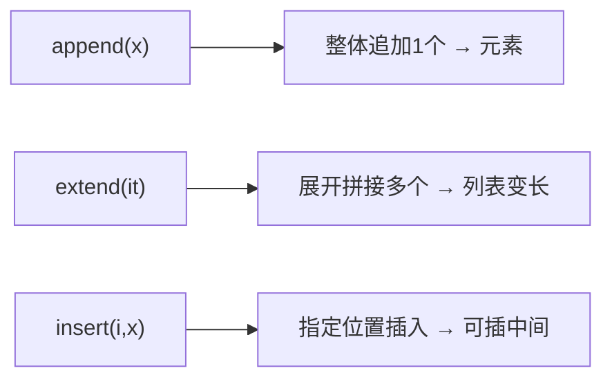
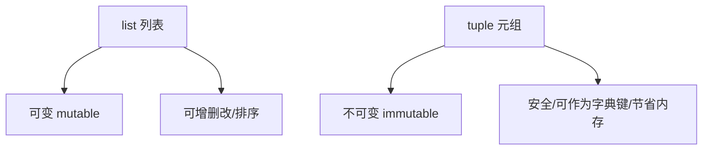

# 第4讲 · 组合数据类型：列表与元组

Python应用程序设计(B) · Python 语法（三）

---

# 学习目标

学完本节后，你能够：

- 说明列表（list）与元组（tuple）的定义、创建与基本特征，说清"列表可变、元组不可变"
- 用列表完成新增、删除、修改、查找、切片、遍历与排序
- 掌握列表的三种插入方法 `append` / `extend` / `insert` 的区别与选用
- 创建并访问元组，掌握元组解包
- 把列表/元组用进 AI 场景（采集图像样本、排序损失值、批量处理文本）

---

# 回顾：为什么要"组合数据类型"

之前一段代码只能保存一个数/一字符串。

> "如果我要保存全班 40 个同学的名字，怎么办？"
> 用 40 个变量？太笨了 → 需要 **列表**。

```python
score = 88            # 单个变量
scores = [78, 88, 95, 66]   # 一个列表装多个分数
```

- 类比：变量是**单人座位**，列表是**一排座位**，元组是**固定好的贵宾席（不能调座）**。

---

# 列表（list）：基本语法

```python
nums = [1, 2, 3, 4]        # 整数列表
names = ["Alice", "Bob"]   # 字符串列表
mix   = [1, "A", 3.14]     # 可混型列表
empty = []                 # 空列表

print(nums[0])     # 1  → 下标从 0 开始
print(names[-1])   # 'Bob' → 负数下标从右数
print(len(nums))   # 4  → 元素个数
```

> 列表是**可变的（mutable）**：创建后仍可增、删、改。

---

# 修改列表元素

```python
scores = [78, 88, 95]
scores[1] = 99        # 改：把下标1换成99
print(scores)         # [78, 99, 95]

scores.append(100)    # 末尾追加一个元素
scores.remove(78)     # 删除值78（第一个匹配）
popped = scores.pop() # 弹出并返回末尾元素
print(scores)         # [99, 95]
```

增、删、改都在原列表上进行——这正是"可变"的体现。

---

# ⭐ 重点 + ❗ 难点：三种插入方法

> 这是本讲难点，务必分清三者：

```python
lst = [1, 2, 3]

lst.append(4)           # 追加"一个元素"→ [1,2,3,4]
lst2 = [1, 2, 3]
lst2.extend([4, 5])     # 把列表"展开拼进去"→ [1,2,3,4,5]
lst3 = [1, 2, 3]
lst3.insert(1, 99)      # 在"位置1"前插入 → [1,99,2,3]

# 易错：append([4,5]) 是追加一个整体 → [1,2,3,[4,5]]
```

| 方法 | 作用 | 结果示意 |
|---|---|---|
| `append(x)` | 追加**单个**元素 | `[1,2]` → `[1,2,3]` |
| `extend(it)` | 把**可迭代对象展开**拼接 | `[1,2]` → `[1,2,3,4]` |
| `insert(i, x)` | 在**指定位置**插入 | `[1,2,3]` → `[1,99,2,3]` |



---

# 切片（slicing）：取一段

```python
nums  = [10, 20, 30, 40, 50]
print(nums[1:4])     # [20,30,40]  → 含头不含尾
print(nums[:3])      # [10,20,30]  → 从头到位置3
print(nums[::2])     # [10,30,50]  → 步长为2
print(nums[::-1])    # 反转整张列表
```

- 切片 `[start:stop:step]`，**stop 不包含在内** —— 最容易记混的地方。

---

# 遍历列表

```python
names = ["Alice", "Bob", "Cathy"]

# 直接遍历元素
for name in names:
    print(name)

# 带下标遍历
for i, name in enumerate(names):
    print(i, name)

# 列表推导式（快速生成新列表）
squares = [x * x for x in range(1, 6)]
print(squares)      # [1, 4, 9, 16, 25]
```

`for x in list:` 是 Python 最常用的批处理方式。

---

# 排序：sort()

```python
losses = [0.9, 0.4, 0.6, 0.2, 0.7]
losses.sort()              # 原地升序
print(losses)              # [0.2,0.4,0.6,0.7,0.9]
losses.sort(reverse=True)  # 原地降序
print(losses)              # [0.9,0.7,0.6,0.4,0.2]

words = ["banana", "apple", "cherry"]
words.sort()               # 字符串按字母序
print(words)               # ['apple','banana','cherry']
```

> `sort()` 直接改原列表（原地），`sorted(list)` 返回新列表不改原列表。

---

# AI 落地：sort 分析训练损失值

```python
# 训练过程中每轮的损失值列表
epoch_losses = [1.2, 0.8, 0.6, 0.3, 0.2]

stable = sorted(epoch_losses)      # 不看顺序，看数值分布
print("最低损失:", stable[0])       # 0.2

epoch_losses.sort(reverse=True)    # 降序排列，观察训练收敛
print("从高到低:", epoch_losses)
```

应用思路：把训练日志的损失收集成列表 → `sort` 或 `sorted` → 快速看最低值/收敛趋势。

---

# 嵌套列表：二维数据

```python
grades = [
    [78, 88, 95],
    [66, 70, 80],
    [90, 92, 99],
]
print(grades[0][1])     # 88 → 第0个学生的第1门课

for row in grades:         # 每行是一个班级
    total = sum(row)
    print("该行总分:", total)
```

列表里可以再套列表，常用于保存二维表格、样本矩阵。

---

# AI 落地：append 采集图像样本

```python
dataset = []                      # 开始是空的数据集
for i in range(1, 6):
    dataset.append(f"img_{i:03d}.jpg")  # 每次追加一个样本名
print(dataset)
```

应用思路：模型训练前，把图像/文本样本名逐条 `append` 进数据集列表，再批量送入识别流程。

---

# 元组（tuple）：基本语法

```python
t = (1, 2, 3)          # 创建元组
t2 = ("apple",)        # 单个元素必须有逗号！
print(t[0])            # 1 → 也支持下标
print(len(t))          # 3

a, b, c = t            # 元组解包
print(a, b, c)         # 1 2 3
```

> 元组是**不可变的（immutable）**：创建后不能增、删、改。

---

# 列表 可变 vs 元组 不可变

```python
lst = [1, 2, 3]
lst[0] = 99            # ✅ 列表可以改
print(lst)             # [99, 2, 3]

t = (1, 2, 3)
t[0] = 99              # ❌ TypeError: 'tuple' object ...
```



- 元组"不能改"是特性而非缺陷：**需要保护不被意外修改的数据用元组**。

---

# AI 落地：遍历批量处理 NLP 文本

```python
raw_texts = ["Hello", "WORLD", "python"]
cleaned = []
for text in raw_texts:
    cleaned.append(text.lower())   # 统一转小写（清洗）
print(cleaned)                     # ['hello','world','python']

nouns = ("cat", "dog", "bird")     # 词性表用元组（只读常量）
for w in nouns:
    print(w)
```

应用思路：遍历每条文本做统一清洗（去标点/转小写）批量生成干净语料。

---

# 常见错误

| 错误代码 | 原因 | 正确做法 |
|---|---|---|
| `lst.append([4,5])`（想要 `[1,2,3,4,5]`） | `append` 是整体追加 | 用 `lst.extend([4,5])` |
| `t[0] = 99`（元组） | 元组不可变 | 改用列表，或用元组只读 |
| `nums[5]` 但长度只有 4 | 下标越界 | 先看 `len`，或遍历 |
| `t = (5)` 想要单元素元组 | 少了逗号 | 写 `t = (5,)` |
| `sort()` 后想保留原列表 | 原地修改 | 用 `sorted(list)` |

---

# 实验任务

- 🔵 基础任务：列表 CRUD + 遍历；创建/访问元组
- 🟡 进阶任务：`extend`/`insert` 构建数据集；`sort` 损失；元组解包；AI 文本批量清洗
- 🔴 挑战任务：用列表+ `insert`/`sort` + 元组管理并分析一组数据

提交要求：可运行的 `.py` 文件 + 关键输出截图。

---

# 思考点

> **为什么说列表属于一种序列类型？**

1. 序列（sequence）类型有哪些共性？列表具备哪些？
2. 列表和元组都支持下标与切片，它们和更早学的字符串有什么共同点？
3. 可变的列表 vs 不可变的元组，你会在什么场景各用哪个？

---

# 小结 + 预告

- 本课要点：列表增删改查/追加/插入/切片/遍历/排序；元组与解包；可变 vs 不可变
- 下次课：**集合（set）与字典（dict）**
- 预习：Python 的集合与字典（大纲作业）

> 学会了把数据"打包"，你的程序才真正开始处理批量数据 🎯