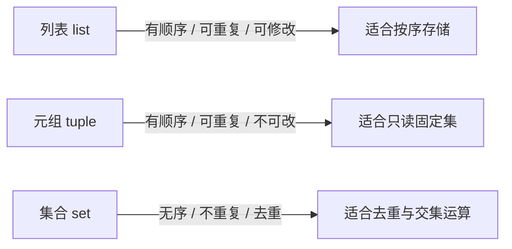
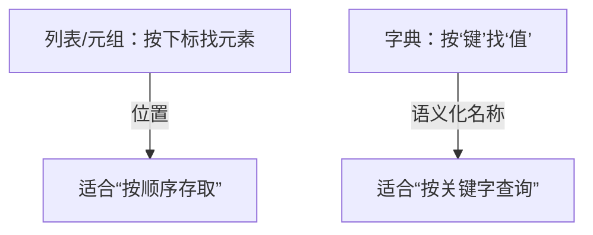

# 第5讲 · 集合与字典

Python应用程序设计(B) · 三、组合数据类型（续）

---

# 学习目标

学完本节后，你能够：

- 说明集合的特征（无序、元素不重复、元素须可哈希）及其与列表/元组的区别
- 用集合完成去重、交集、并集、差集等操作
- 说明字典"键值对"存储特征及"键不可变、值可变"的规则
- 用 `{}`、`dict()`、`dict.fromkeys()`、`dict(zip())` 等多种方法构造字典，并完成增删改查
- 在"去重清洗、词频统计、AI 模型配置"等场景中选用正确的容器类型

---

# 开场提问

> 现有一段"用户点击日志"，里面有很多重复项：

```
['手机', '手机', '耳机', '平板', '耳机', '手机']
```

- 如何**只保留唯一值**，便于做推荐/统计？
- 如何找出**两位用户共同的兴趣标签**？

今天的主角：**集合（set）** 和 **字典（dict）** 正是解决这类问题的"利器"。

---

# 什么是集合（set）

- **无序**：存放的元素没有先后顺序，不能用下标 `s[0]` 访问
- **元素不重复**：重复元素会自动去重（这是最大价值之一）
- **元素须"可哈希"（不可变类型）**：数字、字符串、元组可以；**列表不行**

```python
tags = {"体育", "科技", "游戏", "体育", "科技"}
print(tags)          # {'体育', '游戏', '科技'} —— 自动去重、顺序不定
```

> 类比：一个"只收不重复物品的收纳盒"，放重了会自动丢弃多余的同款。

---

# 集合 vs 列表/元组



| 类型 | 顺序 | 允许重复 | 元素可变类型 | 可否下标 |
|---|---|---|---|---|
| list | 有 | 可以 | 可以 | `l[0]` |
| tuple | 有 | 可以 | 不可(本身) | `t[0]` |
| **set** | **无** | **不可以** | **元素须可哈希** | **不可以** |

---

# 集合的基本操作

```python
s = set()              # 空集合（注意：{} 是空字典）
s.add("a")            # 增
s.add("a")            # 重复，不生效
s.discard("b")        # 删（不存在也不报错）
print(s, len(s))       # {'a'} 1

# 交集 &   并集 |    差集 -    对称差 ^
A = {"体育", "科技", "音乐"}
B = {"科技", "游戏"}
print(A & B)   # 交集 {科技}
print(A | B)   # 并集 {体育,科技,音乐,游戏}
print(A - B)   # 差集 {体育,音乐}
```

> 运算符 `& | -` 直观且常用，也有对应方法 `intersection/union/difference`。

---

# 集合实践：去重清洗 + 共同兴趣

**场景1：推荐系统用户行为数据去重清洗**

```python
raw = ["A", "B", "A", "C", "B", "A"]
unique = sorted(set(raw))
print(unique)         # ['A', 'B', 'C'] —— 得到“唯一的物品集合”
```

**场景2：找两个用户群体的共同兴趣标签**

```python
userA = {"电子", "游戏", "运动"}
userB = {"运动", "摄影", "电子"}
print(userA & userB)  # 共同兴趣 {'运动', '电子'}
```

> 一行代码完成“海量重复数据的去重（清洗）”，这就是 set 在数据处理中的威力。

---

# 什么是字典（dict）

- 以**键值对（key-value）**方式存储，`{键: 值}`
- 一一对应，用**键**快速查找**值**（类似“查字典”或“身份证号 → 信息”）
- **键必须不可变**（数字/字符串/元组），**键唯一**；**值可以是任意类型**、可修改

```python
user = {"name": "Alice", "age": 20}
print(user["name"])    # Alice —— 用键取值
user["age"] = 21       # 修改值
user["city"] = "Xiamen"# 新增键值对
print(user)
```

> 类比：一本"姓名 → 信息"的电话簿，按姓名（键）快速查到对应信息（值）。

---

# 字典 vs 列表/元组



| 维度 | 列表 list | 元组 tuple | 字典 dict |
|---|---|---|---|
| 数据结构 | 有序序列 | 有序序列 | 无序"键→值"映射 |
| 访问方式 | 下标 `l[0]` | 下标 `t[0]` | 键 `d["key"]` |
| 键/元素可变类型 | 任意 | 任意 | **键须可哈希**、值任意 |
| 典型用途 | 按序存储一批数据 | 固定只读序列 | 按名称查询/映射 |

---

# 字典的多种构造方法（难点重点）

```python
# ① 字面量 {键: 值}
d1 = {"name": "Alice", "age": 20}

# ② dict() 传关键字参数（键为标识符）
d2 = dict(name="Bob", age=21)

# ③ dict.fromkeys(键列表, 默认值)
d3 = dict.fromkeys(["x", "y", "z"], 0)   # {'x':0,'y':0,'z':0}

# ④ dict(zip(键列表, 值列表)) —— 两个序列合并成键值对
keys   = ["sport", "tech", "game"]
values = [10, 20, 30]
d4 = dict(zip(keys, values))
```

> 四种构造各有适用：字面量最直观；`fromkeys` 适合"批量默认值"；`zip` 适合"存好两组数据再配对"。

---

# 字典的常用操作

```python
d = {"sport": 10, "tech": 20}

# 取值：方括号 或 get（get 找不到可给默认值，不报错）
print(d.get("sport"))               # 10
print(d.get("food", "免费默认值"))   # 找不到返回默认值

# 遍历
for k in d:              print(k)             # 键
for v in d.values():     print(v)             # 值
for k, v in d.items():   print(k, "->", v)    # 键值对

# 删除
del d["tech"]
```

> `get` 是"安全取值"的常用手法，配合 `d[k] = d.get(k, 0) + 1` 可实现词频统计。

---

# 字典实践：词频统计 + AI 配置表

**场景1：NLP 词频统计**

```python
words = "the apple the banana the apple".split()
freq = {}
for w in words:
    freq[w] = freq.get(w, 0) + 1
print(freq)   # {'the':3, 'apple':2, 'banana':1}
```

**场景2：AI 模型配置参数映射表**

```python
config = {
    "learning_rate": 0.01,
    "epochs": 50,
    "optimizer": "adam",
    "device": "cuda",
}
print(config["optimizer"])   # adam —— 用键名读取配置，清晰可扩展
```

> 字典天然适合"名称→数值/配置"的映射，是 AI/工程代码中的高频容器。

---

# 常见错误

| 错误 | 原因 | 正确做法 |
|---|---|---|
| `s = {}` 当空集合 | `{}` 是空字典 | 空集合用 `set()` |
| `s[0]` 取集合元素 | 集合无序、无下标 | 用 `for` 遍历 |
| `{[1,2]}` 或键用列表 | 列表不可哈希 | 集合/字典键用可哈希类型（数字/字符串/元组） |
| 键重复被覆盖 | 字典键唯一 | 不要用可变/重复做键 |
| 访问不存在的键报 KeyError | 键不在字典 | 用 `d.get(key, 默认值)` |

---

# 实验任务

- 🔵 基础任务：集合去重 + 交并差；字典取值/加改/遍历
- 🟡 进阶任务：用 `dict`/`fromkeys`/`zip` 多种方式构造字典，说明 dict 与 list/tuple 区别
- 🔴 挑战任务（AI 场景）：推荐系统去重+共同兴趣、NLP 词频统计、AI 模型配置参数映射表

提交要求：可运行代码 + 运行结果输出

---

# 思考点

> **字典与哪种数据类型相似？为什么？**

1. 学过的列表 / 元组 / 集合，哪个和字典最像？
2. 为什么要区分"键"和"值"？"键不可变"是为什么？
3. 什么时候该用列表，什么时候该用字典？

---

# 小结 + 预告

- 本课要点：
  - **集合**：无序、去重、交并差 → 数据处理去重清洗
  - **字典**：键值对存储、键不可变 → 词频统计、配置映射
  - 难点：字典的多种构造方法（`{}` / `dict()` / `fromkeys` / `zip`）
- 下次课：**Python 的条件结构（if / elif / else）**
- 预习：Python 的条件结构；思考集合/字典与流程控制的结合

> 学会了"选对容器"，你的数据流淌才顺 🗂️