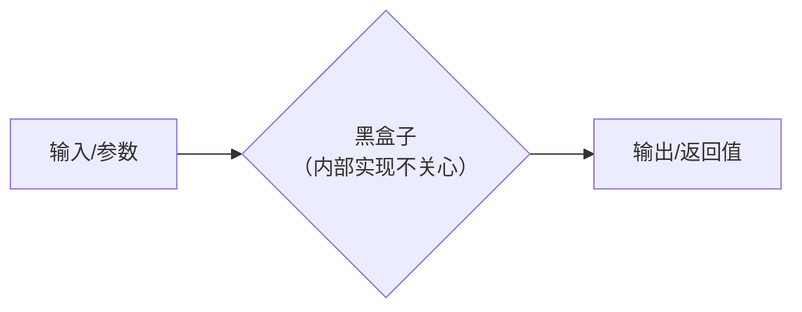
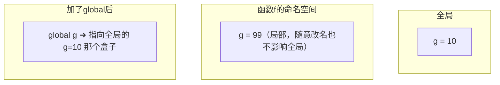
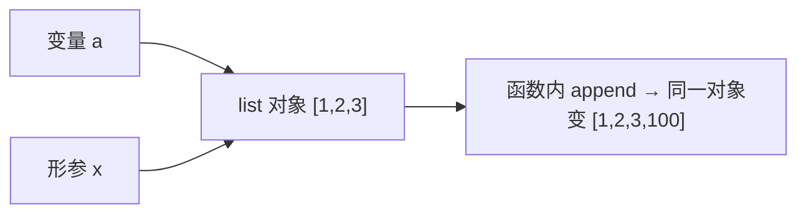

# 第8讲 · Python 语法：函数

Python应用程序设计(B) · 五、Python语法：函数

> 本讲快速带过语法（你有 C 函数基础），重点在 **Python 与 C 的差异** 与参数可变性。

---

# 学习目标

学完本节后，你能够：

- 用 `def` 定义函数并用 `return` 返回结果
- 用位置/关键字/默认/`*args`/`**kwargs` 四种方式调用函数
- 判断函数内变量的作用域（局部 vs 全局），会用 `global`
- 解释可变对象（list）与不可变对象（int/str）作参数的不同表现
- 用"黑盒子"思想体会函数的封装复用价值

---

# 开场：函数到底像什么？

提问：

> "你家的电饭煲，需要知道里面有几根发热管吗？"
> "你用微信，需要知道它内部是怎么加密的吗？"

- 我们要的只是 **按键（输入）→ 米饭/消息（输出）**
- 中间的内部实现，对我们完全是一个"黑盒子"



**函数，就是代码界的黑盒子。** 这是今天的主线。

---

# 为什么要用函数？

- **复用**：一段逻辑只写一次，到处调用
- **清晰**：把大问题拆成小块，每块职责单一
- **隔离**：改内部实现，不影响调用方

> 想一想：如果 100 处都要算圆的面积，你是写 100 遍公式，还是写 1 个函数调用 100 次？

---

# 函数的定义与调用

```python
def 函数名(参数1, 参数2, ...):
    """可选：文档字符串"""
    函数体语句
    return 返回值     # 可选，不写默认返回 None
```

类比 C：相似之处——有名字、有参数、有返回值；
**不同之处**——无返回类型声明、无分号、用**缩进**代替 `{}`、参数不需要写类型。

```python
def greet(name):
    return "你好，" + name

msg = greet("小明")   # 调用：传入实参，接收返回值
print(msg)            # 你好，小明
```

---

# Live Coding：三步走

1. **定义**：`def area(r):` → 算 `3.14 * r * r`
2. **调用**：`a = area(2)`
3. **打印**：`print(a)`

```python
PI = 3.14159

def area(r):
    """计算圆的面积"""
    return PI * r * r

print(area(2))    # 12.56636
print(area(5))    # 78.53975
```

> 多次调用同一个函数 = 「黑盒子」被反复使用，每次只需给不同的 r（输入）。

---

# 四种参数方式（重点⭐）

```python
def register(name, age, city="厦门", *hobbies, **extra):
    print(name, age, city)
    print("可变位置参数:", hobbies)
    print("可变关键字参数:", extra)

# ① 位置参数（按顺序）
register("小明", 20, "福州")
# ② 默认参数：city 不传则用 "厦门"
register("小红", 21, city="泉州")
# ③ *args：收集多余的位置实参 -> 元组
register("小刚", 22, "厦门", "篮球", "编程")
# ④ **kwargs：收集多余的关键字实参 -> 字典
register("小丽", 20, email="li@e.com", 班级="3班")
```

---

# 四种参数速查

| 方式 | 写法 | 调用示例 | 收集结果 |
|---|---|---|---|
| 位置参数 | `f(a, b)` | `f(1, 2)` | 按顺序对应 |
| 关键字参数 | `f(a=1)` | `f(a=1, b=2)` | 指名道姓，顺序可乱 |
| 默认参数 | `def f(a, b=0)` | `f(1)` | b 用默认值 |
| 可变长 | `*args` / `**kwargs` | `f(1,2,x=3)` | 元组 / 字典 |

> **真心话警告**：默认参数不要写可变对象（如 `def f(lst=[])`）——它会"记住"上一次的修改。正确写法是 `def f(lst=None)`，函数内再做判断。示例见 solutions.md。

---

# 常见报错与错误对比

| 错误 | 原因 | 正确做法 |
|---|---|---|
| `SyntaxError` | 忘了写冒号 `:` 或括号不全 | `def f():` 结尾必须冒号 |
| `TypeError: f() missing arg` | 调用时参数个数/关键字不匹配 | 数清形参，或用默认值 |
| `return` 后没有值 | 想要结果却只写 `print` | 函数内用 `return` 返回值 |

---

# 随堂判断题①（预测再运行）

猜猜下面输出什么？

```python
g = 10

def f():
    g = 99      # 没写 global！

f()
print(g)        # 输出 ? （答案：10）
```

- 函数体内**赋值**一个同名变量，会**新建局部变量**，不改变全局 g
- 只有声明 `global g`，才能修改它

```python
g = 10
def f():
    global g
    g = 99
f()
print(g)        # 99
```

---

# 作用域内存模型图



概念：**局部变量**（函数内创建，函数结束即销毁） vs **全局变量**（整个模块可见）。
判定口诀：声明在函数体外 → 全局；声明在函数体内 → 局部（除非 `global`）。

---

# 关键辨析：可变 vs 不可变（难点❗）

Python 传参的本质——**传对象引用**：

- **不可变对象**（int、str、float、tuple）：像**复印件**，函数内改，外面不受影响
- **可变对象**（list、dict、set）：像**同一份原件**，函数内改，外面跟着变

```python
# 不可变 int
def add(n):
    n = n + 10
    return n

num = 5
r = add(num)
print(num, r)   # 5 15  （num 不变）

# 可变 list
def grow(lst):
    lst.append(100)

data = [1, 2, 3]
grow(data)
print(data)     # [1, 2, 3, 100]  （data 被改了！）
```

---

# 可变性的引用指向图

```python
a = [1, 2, 3]
def grow(x):
    x.append(100)   # 改的是同一份 list
grow(a)
```



- a 和 x **指向同一个 list 对象**，所以函数内改动影响函数外
- 而 int 是不可变，重新赋值 `n=n+10` 只是让形参 n 指向一个新数字，原来的 num 不动

---

# 上机任务（分层）

- 🔵 基础：定义 `area_circle(r)` 计算面积并正确调用 3 次
- 🟡 进阶：用默认/关键字/`*args`/`**kwargs` 改造；写一个用 `global` 计数器的函数
- 🔴 挑战：写"学生花名册"函数，传 list 在其内部增删，观察函数外变化并解释；尝试封装一个信号幅值统计函数

提交要求：`.py` 源码 + 运行结果截图

---

# 思考点

> **函数与黑盒子的相同点在哪里？**

参考答案（学习角度）：

- 都是**只暴露输入/输出接口，屏蔽内部实现**
- 使用者只需知道"给什么→得什么"，无需关心内部怎么做
- 好处：安全（不易误用）、复用（到处可用）、易维护（内部随便改，接口不变即可）

下次课预告：**Python 的匿名函数**（lambda）。

---

# 小结 + 预告

- 本课要点：
  1. `def`/`return` + 调用
  2. 四种参数 + 默认参数陷阱
  3. 局部 vs 全局（`global`）
  4. 可变对象（引用传递）vs 不可变对象（值传递）
  5. 函数 = 黑盒子
- 下次课：**匿名函数 lambda**
- 预习：Python 的匿名函数；完成函数相关作业

> 会封装、会隔离、会复用——你就掌握了程序设计的分层思想 🗃️