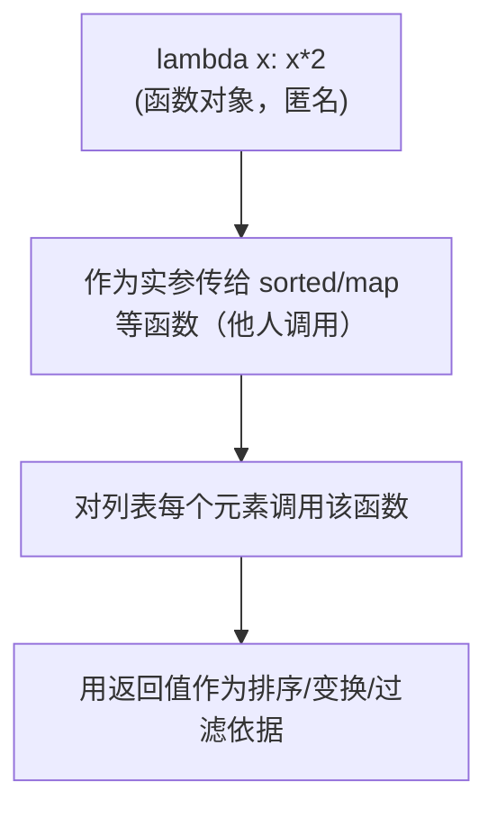
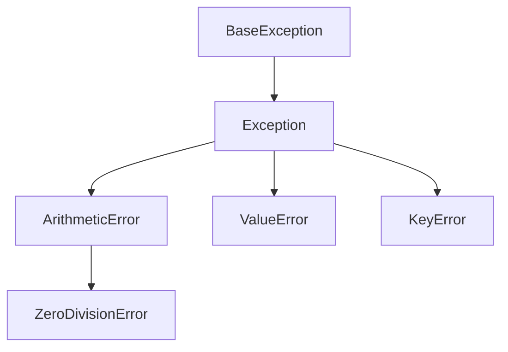

# 第9讲 · Python语法：函数（续）

Python应用程序设计(B) · 匿名函数 · 内置函数 · 异常处理

---

# 学习目标

学完本节后，你能够：

- 构造匿名函数 `lambda`，理解它"匿名"背后的执行原理
- 用内置函数 `sorted` / `map` / `filter` 快速处理数据
- 用 `try/except/else/finally` 严谨地接收和处理异常
- 用多返回值 `return a, b` 输出"预测结果 + 置信度"

---

# 开场提问

> "上讲的 `def` 函数，能不能不先起名字，就拿来直接用？"

再想一个场景：程序运行到一半**崩溃**了，怎么让程序自己"兜住"？

- 你愿意为"不出错"写多少额外代码？
- 一个不捕获异常的程序，在企业里够不够"严谨"、够不够"安全"？

---

# 匿名函数 lambda（重点⭐）

**语法：** `lambda 参数: 表达式`

```python
add = lambda a, b: a + b      # 等价于 def add(a, b): return a + b
print(add(3, 4))              # 7
```

- 它**只含一个表达式**，自动返回其结果（不能写 `return`，不能写多条语句）
- Lambda 对象就是**普通函数对象**，可以赋值、传参、放列表里

```python
funcs = [lambda x: x + 1, lambda x: x * 2]
print(funcs[0](5), funcs[1](5))   # 6 10
```

---

# lambda 的核心用法：作为参数传入

lambda 的价值不在"懒得起名"，而在**就地定义、就地传给别的函数去调用**：

```python
pairs = [("b", 2), ("a", 4), ("c", 1)]
# 按第 2 个元素排序（key 参数接收一个"函数"）
print(sorted(pairs, key=lambda t: t[1]))
# [('c', 1), ('b', 2), ('a', 4)]
```

> 问：调用 `sorted` 时，`lambda` 还没名字，它怎么知道要排序谁？
> 答：`sorted` 会对每个元素调用该匿名函数，用返回值作为排序依据——**它由别人调用，所以名叫"匿名"也能工作**。

---

# 难点❗ 匿名函数的执行原理



- `lambda` 是**表达式**，求值后得到**一个函数对象**，仅此而已
- "匿名" = 不绑定到名字，由使用者（如 `sorted`、`map`、`filter`）在执行时调用
- 也可临时赋给变量，但那就不再"匿名"了

---

# 内置函数：sorted（重点⭐）

`sorted(iterable, key=函数, reverse=布尔)` —— 返回**新列表**，不改变原列表

```python
ages = [22, 18, 30, 16, 25]
print(sorted(ages))                       # [16, 18, 22, 25, 30]
print(sorted(ages, reverse=True))         # [30, 25, 22, 18, 16]

temps = [("哈尔滨", 2), ("上海", 28), ("厦门", 32)]
print(sorted(temps, key=lambda t: t[1], reverse=True))
# [('厦门', 32), ('上海', 28), ('哈尔滨', 2)]
```

> 对比：`ages.sort()` 是原地排序，直接改原列表，返回 `None`。两者别混。

---

# 内置函数：map 与 filter（重点⭐）

**map(函数, 可迭代对象)** —— 对每个元素变换，返回迭代器

```python
nums = [1, 2, 3, 4]
print(list(map(lambda x: x * x, nums)))   # [1, 4, 9, 16]
print(list(map(str, nums)))               # ['1', '2', '3', '4']
```

**filter(函数, 可迭代对象)** —— 保留使函数返回 `True` 的元素

```python
a = [22, 18, 30, 16, 25]
print(list(filter(lambda x: x >= 18, a))) # [22, 18, 30, 25]
```

> 注意：`map`/`filter` 返回的是**迭代器**，要 `list()` 转成列表才能直接打印。

---

# 异常：程序"崩溃"到底是什么

- 一个未处理异常会让程序**中断退出**，后续流程全部停摆
- 对企业/系统：崩溃 = 数据丢失、服务不可用、被攻击的缺口

```python
# 未捕获异常 —— 程序崩溃
# print(10 / 0)        # ZeroDivisionError: division by zero
# int("abc")           # ValueError: invalid literal ...
```

> ⭐ 严谨的工程师：**预判可能出错，判定并接收异常**，而不是任它崩溃——这是保护系统安全的第一步。

---

# try / except（重点⭐）

```python
def safe_div(a, b):
    try:
        return a / b
    except ZeroDivisionError:
        return "除数不能为 0"

print(safe_div(10, 0))   # 除数不能为 0 —— 程序没崩溃
```

**多分支捕获**：不同异常给不同提示

```python
def read_item(d, key):
    try:
        return d[key]
    except KeyError:
        return "键不存在"
    except TypeError:
        return "key 类型错误"
```

---

# else 与 finally（重点⭐）

- `else`：**没有异常**才执行（try 块顺利走完时）
- `finally`：**无论有无异常**都执行（清理资源）

```python
def f(v):
    try:
        r = int(v)
    except ValueError:
        print("不是数字")
    else:
        print("转换成功，值为", r)
    finally:
        print("finally 总会执行")

f("123")   # 转换成功 → finally
f("abc")   # 不是数字 → finally
```

---

# 异常是"类"，有层次（难点❗）



- except 匹配按**类及子类**：`except ArithmeticError` 能接住 `ZeroDivisionError`
- 多分支时**子类在前、父类在后**，否则父类会抢先接住

```python
try:
    1 / 0
except ZeroDivisionError:      # 子类在前
    print("除零了")
except ArithmeticError:        # 父类在后
    print("算术错误")
```

---

# 接收所有异常的"不足"（思考点）

**裸 `except:` 能接住一切**：

```python
try:
    # 某段有风险的代码
    int("abc")
except:               # 含 KeyboardInterrupt、内存错误、系统错误……
    print("出错了")
```

**不足之处 ❗：**

- 把 `KeyboardInterrupt`（Ctrl+C）、系统级错误也**一并吞掉**，用户无法中断
- **掩盖 bug**——你甚至不知道出了什么错、在哪儿出、为什么出
- 安全隐患：系统性风险被静默吞掉，不利于维护与安全审计

> 正确姿势：**能预判的异常用 `except Exception as e` 并精准捕获子类**；确实无法预期的，也要让最外层记录日志再兜底。

---

# AI 赋能点：多返回值输出预测 + 置信度（重点⭐）

```python
def predict(score):
    pred = "通过" if score >= 60 else "不通过"
    conf  = min(score / 100, 0.99) + 0.01   # 简化置信度
    return pred, conf           # 返回元组：结果 + 置信度

result, confidence = predict(85)   # 解包
print(f"预测: {result}, 置信度: {confidence:.2f}")
```

- `return a, b` 实际返回的是**元组** `(a, b)`，一行解包成两个变量
- 常用于模型推理：不再是"只给一个结论"，而是给出**结果 + 置信度/概率**
- `sorted(..., key=..., reverse=True)` 可一键排序出"最可能的 top-K"

---

# 实验任务

- 🔵 基础任务：lambda 改写 `def` + `sorted`/`map`/`filter` 数据处理 + 多分支 except
- 🟡 进阶任务：多返回值函数封装"预测结果 + 置信度"
- 🔴 挑战任务：自定义异常类 + 裸 except 危害对比 + 健壮"安全除法"

提交要求：代码运行结果截图 + 源代码

---

# 思考点

> **匿名函数如何实现"匿名"？如何接收所有的异常？不足在哪里？**

1. `lambda` 没有名字，为什么还能被调用？
2. 用 `except:` 能否接收所有异常？能不能、该不该这么做？
3. 不分青红皂白地 `except:` 会带来什么隐患？

---

# 小结 + 预告

- 本课要点：lambda 构造与执行原理、`sorted/map/filter`、`try/except/else/finally`、异常类层次、多返回值
- 下次课：**面向对象**（类、对象、封装、继承）
- 预习：面向对象基本概念；预习类练习题

> 严谨接收异常，才能写出安全、可靠、可维护的程序 🛡️