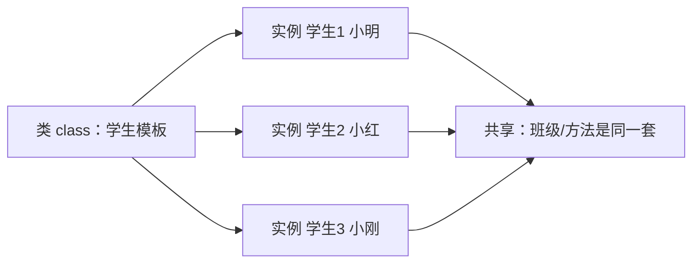

# 第10讲 · 类与面向对象

Python应用程序设计(B) · 六、Python语法：类与面向对象

---

# 学习目标

学完本节后，你能够：

- 说明面向对象思想，认识"类 = 共性模板，实例 = 个性个体"
- 用 `class` 定义类、实例化对象，并正确调用属性和方法
- 编写 `__init__` 构造函数，理解 `self` 的作用
- 辨析实例属性与类属性的区别
- 体会"共性框架与个性差异"蕴含的"集体与个体"辩证关系

---

# 开场提问

> "要给全班每个学生登记『姓名、学号、班级』，并在需要时喊出他们的自我介绍，你会怎么做？"

- 用 C 你会写多少个结构体？
- 能不能让一份"登记表模板"，套用到每一个学生？

一个模板，复制出很多份——这就是"类与对象"。

---

# 面向对象：类是模板，对象是实例

- **类（class）：** 一份"设计蓝图 / 模具"，描述一类事物共有的属性和行为
- **对象 / 实例（instance）：** 用这个模具冲压出的一个个具体个体，各自数据不同

类比：

- 模具 → 车间里一个模具能冲出无数个工件，形状相同、编号各异
- 学生 → 共用一个"学生登记表"，填上不同姓名就成了不同学生



---

# 类的定义和调用（⭐重点）

```python
class Student:
    school = "厦门大学嘉庚学院"   # 类属性（共享）

    def __init__(self, name, age):   # 构造函数
        self.name = name             # 实例属性（个性）
        self.age = age

    def say_hello(self):             # 方法
        return f"我是{self.name}，来自{self.school}"

s1 = Student("小明", 20)      # 创建对象（实例化）
s2 = Student("小红", 21)
print(s1.say_hello())         # 实例.方法()
print(s1.name)                # 实例.属性
print(Student.school)         # 类名.类属性（共享）
```

- **实例化：** `对象名 = 类名(实参)`
- **调用：** `对象.属性`、`对象.方法()`
- `self` 指向"正在调用这个方法的那个对象"

---

# 构造函数 `__init__`（⭐重点）

在创建对象时**自动执行**，用来做初始化。

```python
class Student:
    def __init__(self, name, age):
        self.name = name
        self.age = age

s = Student("小明", 20)
# 创建对象 = 把参数传进 __init__
print(s.name, s.age)
```

- 每次 `Student(...)` 都会自动调用一次 `__init__`
- `self` 就是"刚创建出来的那个对象本身"
- 作用：让每个实例一出生就有属于自己的数据

---

# 实例属性 vs 类属性（❗难点）

| | 类属性 | 实例属性 |
|---|---|---|
| 写在哪儿 | 类体内、函数外 | `__init__` 里 `self.x = ...` |
| 属于谁 | 属于**类**（所有实例共享一份） | 属于**每个实例**（各自独立一份） |
| 访问方式 | `类名.x` 或 `对象.x` | `对象.x` |
| 改一处 | 影响所有实例 | 只影响该实例 |

```python
class Student:
    school = "嘉庚学院"      # 类属性 → 大家都一样
    def __init__(self, name):
        self.name = name     # 实例属性 → 每人不同

s1 = Student("小明")
s2 = Student("小红")
print(s1.school, s2.school)   # 共享：都一样
s1.name = "阿明"              # 改实例属性，只影响 s1
```

> 一句话：**"共性"放类里共享，"个性"放 `__init__` 里自理解各不同**

---

# 思政：共性框架与个性差异

- 多个实例**共享**类的属性和方法 → 共同的框架、共同的目标（集体）
- 每个实例**拥有**独特的私有数据 → 各自的经历与创新（个体）

类比到班级/国家：

- 集体提供统一的行为规范和平台（类的方法与类属性）
- 但尊重每个人独特的数据与个性（实例属性、私有数据）

> 💬 讨论：融入集体靠谱、守规矩，同时鼓励个体独立思考、大胆创新——**集体与个体不是二选一，而是互为成全**。

---

# 公有变量与"私有"变量（__x 名称修饰）

```python
class Student:
    def __init__(self, name, sid):
        self.name = name          # 公有属性
        self.__sid = sid          # "私有"（加了名字修饰）

    def get_sid(self):            # getter：公开的访问通道
        return self.__sid

s = Student("小明", "2025001")
print(s.name)                 # 可以直接读
print(s.get_sid())            # 通过方法读私有
print(s.__sid)                # ❌ AttributeError
print(s._Student__sid)        # ⚠️ 能访问，但不该这么用
```

- `__x` 不是绝对私有，是被重命名为 `_类名__x`（名称修饰）
- **它是"约定"而非"铁锁"** —— 提醒合作者"内部数据，请走公开方法"
- 好处：防止外部随意改写内部状态，保护数据安全

---

# 思考点：为什么要设公有和私有？

> **类的属性和方法为什么要设置公有和私有？**

- **封装：** 把内部实现细节藏起来，外部只通过公开接口使用，调用方不用管内部怎么算
- **安全：** 防止外部代码无意或恶意地把数据改坏（例如余额被改成负数）
- **稳定：** 内部实现可以随意改动，只要公开方法不变，外部代码无需修改
- **约定：** `__x` 不是铁锁，而是"请走正门"的信号

把"需要被别人用"的设为公有，把"自己内部才有意义"的设为私有。

---

# 常见错误

| 错误 | 原因 | 正确做法 |
|---|---|---|
| `def hello(self)` 调用报 TypeError | 方法忘写 `self` | 方法第一参写 `self` |
| `s.hello` 只打印一行地址 | 方法调用漏 `()` | 写成 `s.hello()` |
| 在类体内写 `name = None` 想当每个实例的 | 把实例属性误写成类属性 | 放 `__init__` 里 `self.name=...` |
| 改类属性只影响了一个对象 | 误把共享的当个性的改 | 分清类属性/实例属性 |
| `print(obj.__x)` 报 AttributeError | 访问"私有"被名称修饰 | 用公开方法/getter 访问 |

---

# 上机任务

- 🔵 **基础任务（必做）：** 定义 `Student` 类，实例化两个对象并调用属性和方法
- 🟡 **进阶任务（选做）：** 用 `__init__` 初始化"私有"学号，写 getter；区分类属性与实例属性
- 🔴 **挑战任务（选做）：** 实现 `BankAccount` 类（存钱/取钱），用私有余额 + 受控方法保证数据安全

提交要求：可运行的 `.py` 源文件 + 运行结果截图 + 1 句思考

---

# 小结 + 预告

- 本课要点：类=模板、对象=实例；`__init__` 构造；`self`；实例/类属性；公有/私有
- 思考点：为何设公有私有？（→ 封装、安全、稳定、约定）
- **下次课：类的继承与多态**
- 预习：教材"继承、方法重写、多态"章节，思考"子类如何复用父类的共性？"

> 面向对象的大门已打开，下一个台阶是"继承和多态" 🚪