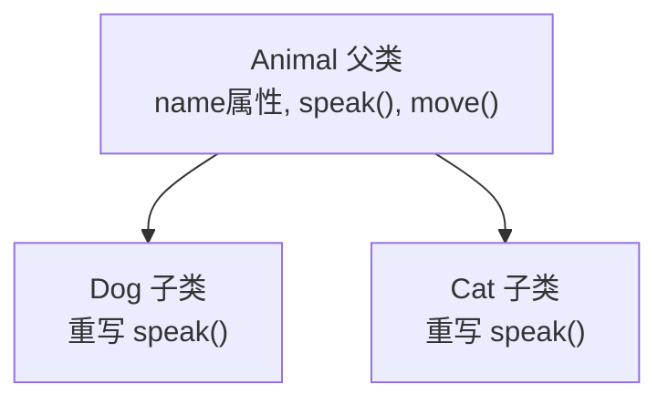

# 第11讲 · 类的继承性与多态性

（类与面向对象 · 续）

Python应用程序设计(B) · 六、Python语法

---

# 学习目标

学完本节后，你能够：

- 解释 `class B(A)` 的继承语义，理解子类如何继承父类的属性与方法
- 对比**两种构造器继承写法**（不写 `__init__` vs `super().__init__()` 扩展）
- 用继承、方法重写与 `super()` 编写层级结构的类
- 用**多态**编写"同一接口、不同实现"的可扩展程序
- 体会 AI 模型类 `train()`/`predict()` 的接口与封装思想

---

# 开场提问（回顾上一讲）

> "类能做的是什么？上节课我们定义了哪些东西？"

- `class 类名:` 定义类
- `__init__` 构造器 + `self` 指向实例
- 实例属性、实例方法、私有成员 `_name`
- `__str__` 美化打印

> 提问：动物有很多种，每一类都要重写一遍「叫」「动」的代码吗？
> —— 引出**继承**。

---

# 类的继承性（一）基础语法

用 `class B(A)` 定义 **子类（派生类）** 继承 **父类（基类）**：

```python
class Animal:
    def __init__(self, name):
        self.name = name          # 实例属性

    def speak(self):
        return f"{self.name} 发出叫声"

    def move(self):
        return f"{self.name} 在移动"

class Dog(Animal):                # Dog 继承自 Animal
    pass                          # 什么也没写，直接用父类的全部内容

d = Dog("旺财")
print(d.speak())   # 旺财 发出叫声   ← 继承来的方法
print(d.move())    # 旺财 在移动     ← 继承来的方法
```

> **继承的意义 = 代码复用**：共性放在父类，个性放在子类。

---

# 类的继承性（二）继承层级图



继承的特点：

- 子类自动获得父类的**属性**与**方法**
- 子类可以**重写**（override）父类的方法，实现自己的行为
- 子类还可以**新增**自己的属性与方法

---

# 属性与方法继承要点

- 父类的实例属性、方法都会**自动进入子类**
- 子类没有的属性方法，Python 会**沿继承链向上查找**到父类

```python
class Cat(Animal):
    pass

c = Cat("咪咪")
print(c.speak())   # 咪咪 发出叫声   ← 没写，继承 Animal 的
print(c.move())    # 咪咪 在移动     ← 继承
```

> 类比：孩子默认继承父母的"姓氏（属性）"和"技能（方法）"，除非自己重写。

---

# 方法重写（override）

子类用**同名方法**覆盖父类的方法：

```python
class Dog(Animal):
    def speak(self):                      # 与父类同名→重写
        return f"{self.name} 汪汪叫！"

class Cat(Animal):
    def speak(self):
        return f"{self.name} 喵喵叫~"

d = Dog("旺财"); print(d.speak())   # 旺财 汪汪叫！
c = Cat("咪咪"); print(c.speak())   # 咪咪 喵喵叫~
```

> 重写时方法名、参数必须一致（这里是 `self`）。

---

# 难点❗ 构造器继承（两种写法对比）

**写法A：子类不写 `__init__`，直接继承父类的构造器**

```python
class Point2D:
    def __init__(self, x, y):
        self.x, self.y = x, y

class Point3D_A(Point2D):
    z = 0                       # 用类属性提供默认值
                                # 不写 __init__ → 使用父类的
p = Point3D_A(1, 2)
print(p)       # x=1,y=2, z=0（只能通过默认补 z）
```

- 优点：改动最少
- 局限：无法在构造时传入并初始化**新增属性** z

---

# 难点❗ 构造器继承（写法B：扩展）

**写法B：子类写 `__init__`，并用 `super().__init__()` 调用父类构造器扩展**

```python
class Point3D_B(Point2D):
    def __init__(self, x, y, z):
        super().__init__(x, y)   # 先初始化父类的 x,y
        self.z = z               # 再新增自己的 z
                                # ↑ 扩展父类构造器

q = Point3D_B(1, 2, 3)
print((q.x, q.y, q.z))          # (1, 2, 3)
```

- `super()` ≈ 指向父类的代理，用来调用父类的成员
- 常见错误：写了子类 `__init__` 却**漏掉 `super().__init__()`** → 父类属性 `x,y` 未初始化

> 记住：**子类自己重写 `__init__` → 必须用 `super().__init__()` 补父类的初始化**。

---

# 构造器继承小结（对照卡）

| 场景 | 写法 | super() 是否调用 |
|---|---|---|
| 子类不需要新增属性 | 不写 `__init__`，直接用父类的 | 不写 |
| 子类需要新增属性/逻辑 | 写 `__init__`，调 `super().__init__(父参)` | 必须调用 |
| 只想"先做父类初始化再补充" | `super().__init__(...)` 放在最前 | 是 |

---

# 类的多态性（一）什么是多态

**多态（Polymorphism）**：同一个接口（方法名），由不同对象给出**不同实现**。

```python
animals = [Dog("大黄"), Cat("小白"), Animal("普通动物")]

for a in animals:              # 统一调用同一方法名 speak()
    print(a.speak())
```

输出：

```
大黄 汪汪叫！
小白 喵喵叫~
普通动物 发出叫声
```

> 调用者只认识"会 `speak()` 的东西"，不关心它具体是 Dog 还是 Cat
> —— **面向接口编程**，代码可扩展。

---

# 类的多态性（二）多态的价值

- 新增子类（如 `Pig`）无需改调用方代码
- 用父类类型统一管理一批子类对象

```python
class Pig(Animal):
    def speak(self):
        return f"{self.name} 哼哼~~

animals.append(Pig("佩奇"))
for a in animals: print(a.speak())   # 不用改，自动支持
```

```mermaid
graph LR
    Caller["调用方 (for a in list)"] -->|speak()| A["Animal 接口"]
    A --> Dog["Dog: 汪汪叫"]
    A --> Cat["Cat: 喵喵叫"]
    A --> Pig["Pig: 哼哼"]
```

> 多态让程序**对扩展开放**：加新类型容易，改旧代码少。

---

# AI 赋能点 ⭐ 类是算法的封装载体

在 AI 模型开发中，类把"算法逻辑"封装起来，对外只暴露两个公共方法：

```python
class BaseModel:
    def train(self, X, y):      # 公共接口：训练
        raise NotImplementedError("子类必须实现 train")
    def predict(self, X):       # 公共接口：预测
        raise NotImplementedError("子类必须实现 predict")

class LinearModel(BaseModel):
    def __init__(self, lr=0.01, epochs=10):
        self._lr = lr           # 私有超参数（下划线），防外部误改
        self._epochs = epochs
        self._w = 0.0            # 私有权重
        self._b = 0.0
    def train(self, X, y):       # 实现：拟合最小二乘直线
        ...                      # 更新 _w, _b
        return self
    def predict(self, X):
        return [self._w*x + self._b for x in X]
```

---

# AI 赋能点 ⭐ 接口与封装的意义

- **公有方法 `train()` / `predict()`**：给外部（用户/上层）用的统一入口
- **私有变量 `_w` / `_b` / `_lr`**：存模型权重与超参数，避免外部误改
- 使用者只关心"喂数据→训练→拿预测"，不关心内部几十行算法

```python
model = LinearModel()
model.train(X, y)      # 对外：训练
result = model.predict(X_new)   # 对外：预测
print(result)
```

> 这就是**封装**：对外稳定接口，对内自由演进。面向对象编程的三大特性在此收尾：**封装、继承、多态**。

---

# 上机任务

- 🔵 基础任务①：定义几何图形父类与子类，演示继承与重写
- 🔵 基础任务②：构造器继承两种写法的对比小程序
- 🟡 进阶任务③：用多态（父类列表统一调用接口）重构动物叫
- 🟢 综合任务④：设计一个继承体系（如运输工具），验证继承+多态
- 🔴 挑战任务⑤：`train()/predict()` + 私有权重的最小 AI 模型类

提交要求：规范命名的 `.py` + 运行结果截图

---

# 常见错误

| 错误 | 原因 | 正确做法 |
|---|---|---|
| 写了 `__init__` 忘调 `super().__init__()` | 不熟构造器继承 | 重写构造器时记得 super 补父类初始化 |
| 子类方法没生效 | 方法名拼写不一致，未真正重写 | 核对方法名是否与父类一致 |
| 父类属性未初始化报错 | 同上 | 先 super() 再设新属性 |
| 多态不用、改用一大堆类型判断 | 没理解接口思想 | 用统一接口 + 子类各自实现 |

---

# 思考点

1. 为什么多态能让程序"对扩展开放、对修改关闭"？
2. 构造器继承中，`super().__init__()` 没写会发生什么？为什么？
3. 一个 AI 模型类把权重设为私有（`_w`），把 `train/predict` 设为公有，好处是什么？

---

# 小结 + 预告

- 本课要点：
  1. 继承：`class B(A)`、属性/方法继承、方法重写
  2. 难点：构造器继承两种写法（不写 `__init__` vs `super()` 扩展）
  3. 多态：同一接口、不同实现
  4. AI 接口范式：`train()/predict()` + 私有权重封装
- 下次课：**类的构造器与综合应用巩固 / 下一语法章节预告**
- 预习：完善综合任务④；完成 HW11

> 面向对象三大特性——封装、继承、多态，至此齐了。