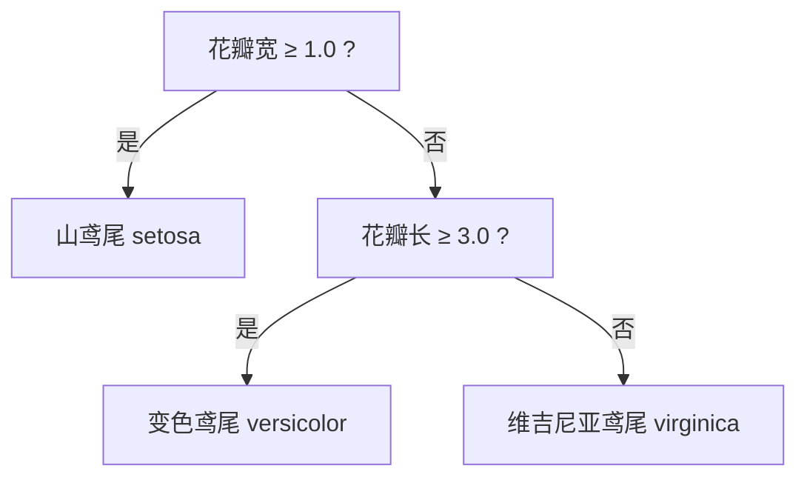

# 第12讲 · Python 机器学习入门

Python应用程序设计(B) · MACHINE LEARNING

---

# 学习目标

学完本节后，你能够：

- 说明监督学习与「分类问题」的基本概念，复述决策树分类的决策过程
- 讲清 KNN 分类算法的三大要素（K 值、距离度量、多数表决）
- 用 scikit-learn 在 Iris 数据上完成「划分 → 训练 → 预测 → 评估」的完整流程
- 理解「数据维度转换」：维度是什么、降维的取舍
- 体会机器学习在实际工作生活中的作用，比较 KNN 与深度模型的取舍

---

# 开场提问

> "手机能自动识别照片里的猫和狗，外卖能猜你喜欢吃什么——背后是什么技术？"

- 这些"智能"从哪里来？
- 我们今天开始，用三讲走进**机器学习**

> ⭐ 本讲定位：**理解原理直觉 + 会调库实现**，不推导数学公式细节

---

# 机器学习是什么

**机器学习**：让计算机从**数据**中自动学习规律，并用规律对新数据做预测。


- 监督学习：数据带**标签**（正确答案），学"输入→标签"的映射
- 无监督学习：数据**无标签**，自己找结构（聚类）

---

# 分类问题：我们把注意力放在哪

**分类** 是最经典的监督学习问题——判断输入属于哪个类别（标签）。

类比：给一个学生测 `身高`、`出勤` 两个特征，判断他「能/不能通过考试」。

- 输入 → 特征（Feature / 维度）
- 输出 → 类别标签（Label）
- 目标 → 学会"从特征到标签"的决策

> 我们学两种经典分类器：**决策树** 与 **KNN**

---

# 决策树分类：一层层地问问题

决策树像**连续做判断题**，每一步根据一个特征做判断，不断分裂，最终落到一个类别。

例：判断一朵花品种

1. 花瓣宽度 ≥ 1.0？是 → 山鸢尾；否 → 再问
2. 花瓣长度 ≥ 3.0？是 → 变色鸢尾；否 → 维吉尼亚鸢尾



---

# 决策树：特点与应用概述

- 每个内部节点 = 对**一个特征**提问；每个叶子 = 一个类别
- 自动从数据中挑出"最能把类别区分开的特征"来提问
- 特点：**可解释**（能看懂"为什么这么分"）、直观

应用示例：

- 银行信贷审批
- 医学辅助诊断
- 邮件分类 / 故障诊断

---

# KNN：物以类聚，人以群分

**KNN（K 最近邻）**：判断一个新样本时，看它在特征空间里**离它最近的 K 个已知样本**，按多数表决决定它的类别。

> 一个点靠近谁，它多半就是谁


---

# KNN 三步流程

以"要做的一个新点"为线索：

1. **算距离**：计算新点到所有已知样本（特征点）的距离 → 常用**欧氏距离**
2. **找邻居**：选距离最近的 **K** 个点
3. **多数表决**：K 个点中哪个类别最多，新点就归为哪类

代码视角（思路）：

```python
d2 = ((已知特征 - 新样本) ** 2).sum(axis=1)  # 欧氏距离平方
最近K个 = 距离最小的 K 个样本
预测 = 这 K 个样本标签中出现次数最多的
```

---

# KNN 三大要素（重点⭐）

1. **K 值**：选取几个最近邻居。
   - K 太小 → 对噪声敏感、易过拟合（受单个点影响）
   - K 太大 → 过度"平均"，边界模糊（K=类别很多时可能欠拟合）
   - 常用经验值：3 ~ 10（奇数便于表决）
2. **距离度量**：衡量"相近"的标准，最常用**欧氏距离**。
3. **多数表决**：K 个邻居所属类别投票，票多者胜。

> ⭐ 记住：**K 值 + 距离度量 + 多数表决** = KNN 的全部

---

# 手算演示：KNN 如何工作

只取两特征（花瓣长、花瓣宽），前两类花（山鸢尾/变色鸢尾）若干点：

新样本 `[1.7, 0.5]` 靠近谁？

```python
import numpy as np
# masked 数据: 两特征 + 前两类标签 (0/1)
new = np.array([1.7, 0.5])
d2 = np.sum((Xs - new) ** 2, axis=1)   # 欧氏距离平方
idx = np.argsort(d2)[:3]               # 取 k=3 个最近邻居
print(d2[idx], ys[idx])                # 距离最小的3个点的标签
# 三个邻居全为 0 → 多数表决预测为 0（山鸢尾）
```

---

# scikit-learn：我们要用的库

**scikit-learn（sklearn）**：Python 最流行的机器学习库，内置经典数据集与现成分类器。

安装：

```bash
pip3 install scikit-learn    # macOS/Linux
pip install scikit-learn     # Windows
```

```python
from sklearn.datasets import load_iris
from sklearn.model_selection import train_test_split
from sklearn.tree import DecisionTreeClassifier
from sklearn.neighbors import KNeighborsClassifier
from sklearn.metrics import accuracy_score
```

---

# 第一步：加载数据 + 训练/测试划分

**为什么划分训练/测试？** 用一部分数据学规律（train），留一部分从未见过的数据（test）检验"学得怎么样"，避免"背答案"。

```python
iris = load_iris()
X = iris.data          # 150 个样本 × 4 个特征(维度)
y = iris.target        # 3 类标签 (0/1/2)

X_train, X_test, y_train, y_test = \
    train_test_split(X, y, test_size=0.3, random_state=42, stratify=y)
print(X_train.shape)   # (105, 4) 训练集
print(X_test.shape)    # (45, 4)  测试集
```

---

# 第二步：训练决策树 与 KNN

```python
# 决策树
dt = DecisionTreeClassifier(max_depth=3, random_state=42)
dt.fit(X_train, y_train)                 # 训练
y_pred_dt = dt.predict(X_test)           # 预测

# KNN
knn = KNeighborsClassifier(n_neighbors=5)  # K 值 = 5
knn.fit(X_train, y_train)
y_pred_knn = knn.predict(X_test)

# 评估
print("决策树准确率:", accuracy_score(y_test, y_pred_dt))
print("KNN(k=5)准确率:", accuracy_score(y_test, y_pred_knn))
```

---

# 第三步：K 值的影响（重点实验）

```python
for k in [1, 3, 5, 10, 20]:
    m = KNeighborsClassifier(n_neighbors=k)
    m.fit(X_train, y_train)
    print(f"k={k:<3} 准确率={accuracy_score(y_test, m.predict(X_test)):.3f}")
```

直观结论（以 2 维花瓣特征为例）：

- k=1：单点决定，可能出现尖峰（噪声敏感）
- k=5：通常最稳
- k=20：过度平均，准确率下降

> "调 k" 就是本讲最典型的一次超参数实验

---

# 难点❗：数据的维度转换

**维度 = 特征个数 = 数据所在空间的坐标轴数。**

- Iris 原始是 **4 维**（4 个特征）：萼长、萼宽、花瓣长、花瓣宽
- 4 维无法直接画图想象，**降维**（少保留几个特征）便于可视化与理解

```python
# 只取第 2、3 个特征（花瓣长度、宽度）→ 降到 2 维，可画散点图
X2 = X[:, 2:]
print(X2.shape)   # (150, 2)
```

**取舍：** 4 维 > 2 维（信息更多，精度通常更高）；2 维 < 4 维（好可视、好解释，但可能丢信息）。

> ❗ 不是维度越多越好：维度多 → 计算量大、可能过拟合、难以解释——这就是"降维"的价值。

---

# 一起看：两特征散点 vs 精度差异

只保留「花瓣长、花瓣宽」两维，三种花分得开、能画图；保留 4 维精度更高。

| 特征数 | KNN(k=5) 准确率 | 可解释/可视化 |
|---|---|---|
| 4 维（全特征） | ~0.978 | 难想象 |
| 2 维（花瓣两特征） | ~0.933 | 好画散点图 |

> 教学生"读数字 + 想为什么"：降维为了看得懂，但会付出一点精度。

---

# 常见错误

| 错误 | 原因 | 正确做法 |
|---|---|---|
| `ModuleNotFoundError: sklearn` | 没装库 | `pip3 install scikit-learn` |
| `fit` 报维度错误 | X/y 不匹配 | `X=iris.data`, `y=iris.target`，shape 对齐 |
| 把"训练"和"预测"顺序搞反 | 流程不清 | 先 `fit` 再 `predict` |
| 降维切片写错 | 维度不熟 | `X[:, 2:]` 取第 3、4 列特征 |
| KNN 没有训练过程觉得怪 | 理解偏差 | KNN 训练只"记数据"，预测才算距离 |

---

# 上机任务

- 🔵 **基础（必做）：** 加载 Iris → 划分 → 训练 KNN(k=5) 与决策树(max_depth=3) → 打印并比较两个准确率
- 🟡 **进阶（选做）：** 对比 k=1/3/5/10/20；对比 2 维 vs 4 维特征的结果，分析维度转换的影响
- 🔴 **挑战（选做）：** 用 NumPy 手写最小 KNN（不调库）实现「算距离→找 K 邻居→多数表决」；或在 13 维 Wine 数据上分类

提交要求：代码 + 运行结果截图 + 对 k 值/维度的简单分析

---

# 思考点

> **KNN 算法相比于深度模型有什么好处？**

1. 深度模型（神经网络）训练需要什么代价？KNN 需要吗？
2. KNN 更容易让人"看明白为什么这么分"吗？这有什么价值？
3. 什么时候 KNN 会力不从心？（数据很大 / 维度很高时？）

---

# 小结 + 预告

- 本课要点：
  - 机器学习 = 从数据中学规律
  - 决策树 = 层层问问题，可解释
  - **KNN = K 值 + 距离度量 + 多数表决**
  - sklearn 标准流程：划分 → 训练 → 预测 → 评估
- 下次课：**二分类问题**（Sigmoid / 逻辑回归）——一种"给概率"的分类方法
- 预习：一分类/二分类什么叫法；回顾 NumPy 与 matplotlib 可视化

> 从今天起，你的 Python 开始"会自己学规律了"