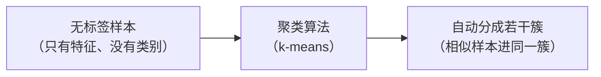
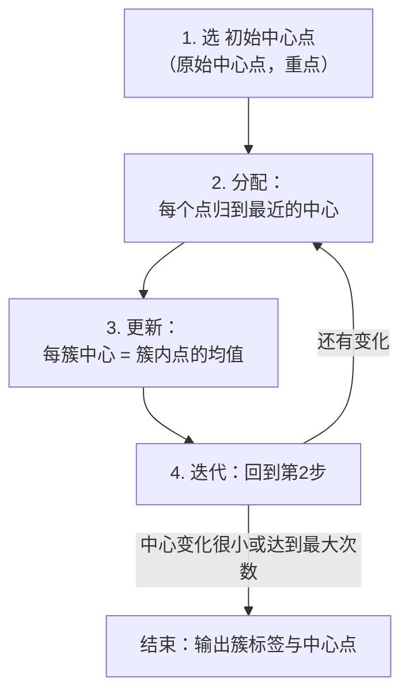

# 第13讲 · 无监督学习与 k-means 聚类

Python应用程序设计(B) · 机器学习入门 · 无监督学习

---

# 学习目标

学完本节后，你能够：

- 说明无监督学习的特点，区分监督学习与无监督学习
- 复述 k-means 聚类的四步迭代流程（选中心→分配→更新→迭代）
- 分析原始中心点（初始中心点）选择对聚类结果的影响
- 用 scikit-learn 对二维数据做 k-means 聚类并可视化
- 用惯性（inertia）与肘部法则选择合理的簇数 K

---

# 开场提问

> 之前学的分类问题，答案都已经"打好了标签"。
> 如果数据**没有标签**，你还能不能让"相似的样本"自动聚在一起？

思考讨论：

- 一张无标签的顾客数据表，你能靠直觉把顾客分几类？
- "不用人工标答案、机器自己分群"——这在生活中有哪些应用？

---

# 监督 vs 无监督学习

| 维度 | 监督学习 | 无监督学习 |
|---|---|---|
| 训练数据 | 有标签（答案已知） | 无标签（只有特征） |
| 目标 | 学一个"输入→答案"的映射 | 发现数据内在结构/分组 |
| 典型任务 | 分类、回归、预测 | 聚类、降维、异常检测 |
| 衡量对错 | 与真实标签对比的准确率/误差 | 簇内紧密、簇间分离等指标 |
| 典型算法 | 线性回归、逻辑回归、KNN、决策树 | **k-means**、DBSCAN、层次聚类 |

> ⭐ 一句话：**有监督"有标准答案"，无监督"自己找规矩"**。

---

# 聚类思想（类比）

电影院想把观众分群，没有"答案"，只凭他们的偏好特征：

- 一组人：喜欢科幻片、爱爆米花、常坐后排 → 可能是一群"普通观众"
- 另一组人：喜欢动画片、带小孩、喜欢早场 → 可能是"亲子家庭"



> ⭐ "聚类 vs 分类"辨析：分类**答案已知**教你怎么分；聚类**答案未知**自己分。

---

# 聚类应用举例

- 🛍️ 顾客画像分群（电商、通信运营商套餐推荐）
- 📰 新闻 / 网页自动去重与归类
- 🧬 生物数据分型、传感数据片段分割
- 🖼️ 图像压缩（把相似颜色聚成一类再编码）
- ⚙️ 异常检测（落在所有簇很远的数据点判为异常）

> 本讲动手任务：对二维数据做**聚类可视化**，直观看到"分出了几团"。

---

# k-means 的思路

输入：数据点 + 预设簇数 K

目标：把点分成 K 个簇，使"每簇内点尽量靠近该簇中心"。

衡量好坏的一个指标——**惯性（inertia）**：

- 惯性 = 所有点到各自簇中心的距离平方和
- 惯性越小，簇内越紧凑，整体越"聚拢"

> sklearn 中：`kmeans.inertia_` 直接给出这个值，我们可以用它比较不同 K。

---

# k-means 四步流程



> 反复执行"分配 + 更新"，直到中心点基本不动——这就是聚类的收敛。

---

# 手算一步（感受原理直觉）

假设 K=2，两个点落在一簇上：

1. 初始中心点取：`c1=(1,1)`、`c2=(8,8)`（假设）
2. **分配**：点 `(1.5,2)` 离 `c1` 更近 → 归簇1；点 `(8.5,9)` 离 `c2` 更近 → 归簇2
3. **更新**：簇1新中心 = 簇1所有点的平均（不再等于原始 `c1`）
4. **迭代**：用新中心重新分配，直到中心不再移动

```python
# 概念示意，不执行
# 中心点 c_next = mean(该簇所有点的坐标)
```

> 核心：**中心点会"漂移"到簇内点的均值位置**，这就是"更新"。

---

# 重点⭐ 原始中心点（初始中心点）

- 第 1 步选点不同 → 可能收敛到**不同的聚类结果**（局部最优）。

比对两种初始化：

| 初始化策略 | 做法 | 特点 |
|---|---|---|
| 随机初始 | 随机选 K 个样本当中心 | 简便，但可能陷入差解、结果不稳定 |
| k-means++ | 让距离已选中心远的点更可能当选 | 更稳、更快收敛，**sklearn 默认** |

- 同一数据两次运行结果不同，**多半不是 bug**，而是初始中心点随机所致。
- 稳定结果的办法：设 `random_state`；加大 `n_init`（sklearn 会从多个初始点取惯性最小的那一个）。

```python
from sklearn.cluster import KMeans
km = KMeans(n_clusters=2, n_init=10, random_state=42)  # 从10个初始点里选最优
```

---

# 代码演示：跑一个最小的 k-means

```python
import numpy as np
from sklearn.cluster import KMeans

# 10 个点，故意分成两团
X = np.array([
    [1, 1], [1.5, 2], [2, 1.5], [2.5, 2], [2, 3],
    [8, 8], [8.5, 8.5], [9, 8], [8.5, 9], [8, 9.5],
])

km = KMeans(n_clusters=2, n_init=10, random_state=42)
km.fit(X)

print(km.labels_)              # 每个点属于哪个簇
print(km.cluster_centers_)     # 每个簇的中心点
print(km.inertia_)             # 惯性（簇内紧凑度）
print(km.predict([[9, 8.5]]))  # 新点(9,8.5) 属于哪一簇
```

---

# K 值怎么选？—— 肘部法则

- K（簇数）不是算法自动给的，得由我们定。
- 循环 K=1,2,3…，记每个 K 的 `inertia_`：**K 越大惯性越小**。
- 画"K – 惯性"曲线：曲线由陡变缓的"拐点"处，增量收益骤减，那个 K 通常最合理。

```python
from sklearn.cluster import KMeans
K = range(1, 8)
inertias = [KMeans(n_clusters=k, n_init=10, random_state=42).fit(X).inertia_ for k in K]
# 打印/绘制 inertias，找拐点的 K
```

> 拐点就像"胳膊肘"，过了它曲线变平缓——多分一簇不再明显变好。

---

# 常见错误

| 错误 | 原因 | 正确做法 |
|---|---|---|
| 把"聚类"当"分类" | 混淆监督/非监督 | 先问"数据有没有标签"再用对应算法 |
| 两次运行结果不同就怀疑 bug | 初始中心点随机 | 设 `random_state`、加大 `n_init` 或默认 k-means++ |
| 忘标准化、量纲大的特征主导距离 | 距离受尺度影响 | 聚类前先 `StandardScaler` |
| K 值随手选 2 | 不知道如何选簇数 | 用肘部法则/`inertia_` 曲线 |
| 只看标签不看中心点 | 不理解模型产出 | `fit` 后同时看 `cluster_centers_` |

---

# 实验任务

- 🔵 基础任务：10 点小数据跑 `KMeans(n_clusters=2)`，打印标签/中心点/惯性，判断新点归属
- 🟡 进阶任务：对比随机初始与 k-means++ 的结果；对 `make_blobs` 数据用肘部法则选 K
- 🔴 挑战任务：用 numpy 手写简化 k-means 与 sklearn 对比

提交要求：聚类散点图（按簇着色 + 中心点）+ 关键代码

---

# 小结 + 预告

- 本课要点：无监督学习特点、k-means 四步流程、**原始中心点（初始中心点）的影响**、肘部法则选 K
- 下次课：聚类算法的扩展（DBSCAN / 层次聚类 / 降维 PCA）与真实数据聚类项目
- 预习：教材"聚类算法"章节；思考 k-means 的局限（只能分球形簇、对离群点敏感）

> 学会这一讲，你就掌握了"没有标准答案也能发现问题结构"的技能 🔍