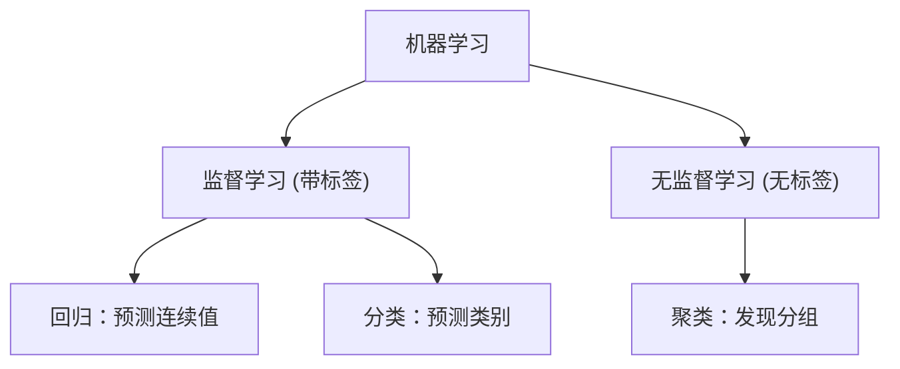
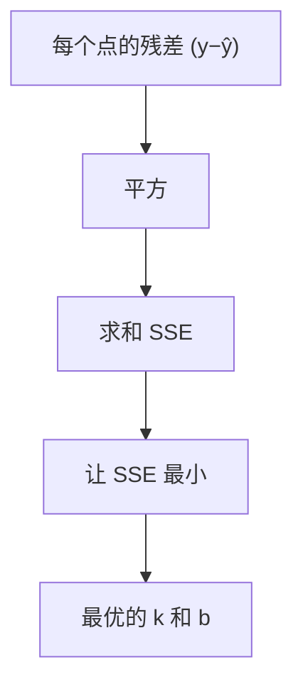

# 第14讲 · 机器学习入门 —— 线性回归

Python应用程序设计(B) · 七、Python机器学习入门

---

# 学习目标

学完本节后，你能够：

- 用一句话说明"机器学习 / 监督学习"是什么，举出生活中的例子
- 写出线性回归的数学模型 **y = kx + b**，并解释每个符号的含义
- 用最小二乘的直观思想，理解"怎样找到一条最合适的直线"
- 用 scikit-learn 的 `LinearRegression` 拟合数据，读取系数与截距，预测新样本

---

# 开场提问

> "给你过去几年某城市的房价，你能预测明年该区一套新房大概卖多少钱吗？"

思考讨论：

- 人是怎么"估"出来的？靠什么线索？
- 这种"从历史数据找规律 → 预测未来"的能力，能不能让计算机学会？

---

# 机器学习是什么

> **机器学习**：让计算机从数据中自动学习规律（模型），并用它来做预测或决策，而不需要人手动编写每一条规则。

- 历史数据 → 学习 → 模型 → 对新数据做出预测
- 我们之前写的都是"人写死规则"，而机器学习是"让数据自己说话"


---

# 监督学习 vs 无监督学习

- **监督学习**：训练数据里"带答案"（有标签），学的是"输入 → 输出"的映射。→ 回归 / 分类
- **无监督学习**：数据"没答案"，学的是数据本身的结构。→ k-means 聚类（第13讲已学）

线性回归属于 **监督学习**，解决的是"预测一个**连续数值**"的问题。



---

# 线性回归：概念

> **线性回归**：找到一条直线，让它"尽量贴合"所有数据点的走势，然后用这条直线做预测。

- 想象把数据画成散点图，我们想用一条直线把它们的"大趋势"概括出来
- 例子：**房屋面积 → 价格**、**温度 → 能耗**、**学习时间 → 成绩**


---

# 数学模型 y = kx + b

一条直线有三个要素：

- **y**：真实/观测值（price）
- **ŷ**：模型预测值（`ŷ = k·x + b`）
- **k**：**斜率 / 系数**(coefficient)——x 每变化 1，y 平均变化多少
- **b**：**截距**(intercept)——x=0 时的 y 值

> ⭐ 我们的目标，就是找到一组**最合适的 (k, b)**。

---

# 最小二乘：直观思想

- 每个数据点与直线之间有一段"误差"，叫**残差 (residual)**：`y - ŷ`
- 直线"贴得好不好" = 所有残差(的距离)越小越好
- 残差有正有负，直接相加会互相抵消 → 于是取**平方**

**最小二乘 (Least Squares)**：找一组 (k, b) 使所有残差的平方和 **SSE** 最小：



---

# 为什么用"平方"？

类比一下：

- 残差有正有负，直接相加会抵消（正误差 + 负误差 = 0，自欺欺人）
- 平方：既消除正负抵消，又放大"偏差大的点"的惩罚
- 平方后 SSE 是一个开口向上的"碗"，有唯一的谷底，能用数学一步求出最优解

> ❗ 最小二乘的**数学结论**：当 SSE 对 k、b 求导为 0 时，可有闭式解。课堂上我们用 sklearn 让库帮我们自动完成这一步。

---

# 用 scikit-learn 实现（准备环境）

```python
# 首次使用先安装（在命令行执行，非本文件）：
#   pip3 install scikit-learn matplotlib
```

- `sklearn.linear_model.LinearRegression`：现成的线性回归模型
- `model.fit(X, y)`：喂入数据，内部自动用最小二乘求得最优 k、b
- `model.coef_`：斜率 k（可能有多个特征 → 多个系数）
- `model.intercept_`：截距 b
- `model.predict(X_new)`：对新样本做预测

---

# 演示：面积-价格（Live Coding）

```python
# lr_demo.py
import numpy as np
from sklearn.linear_model import LinearRegression

# 数据：7 套房子的面积(㎡) 与 价格(万元)
area  = np.array([50, 70, 80, 100, 120, 130, 150]).reshape(-1, 1)
price = np.array([45, 62, 70, 88, 105, 112, 130])

model = LinearRegression()      # 线性回归模型
model.fit(area, price)          # 训练：求最优 k、b

print("斜率 k =", model.coef_[0])
print("截距 b =", model.intercept_)
```

---

# 预测新样本

```python
new_area = np.array([[95]])              # 想预测 95 ㎡ 的房价
pred = model.predict(new_area)
print("95㎡ 预测价格 = {:.2f} 万元".format(pred[0]))

# 与手写公式核对：ŷ = k·x + b
k = model.coef_[0]
b = model.intercept_
manual = b + k * 95
print("手写公式预测 = {:.2f} 万元".format(manual))
```

> 两种结果应一致——证明 `predict` 内部就是做了 `k·x + b`。

---

# 可视化：散点 + 拟合线

```python
import matplotlib.pyplot as plt

xs = np.linspace(40, 160, 100)          # 光滑的 x 轴
ys = model.intercept_ + model.coef_[0] * xs

plt.scatter(area, price, color='blue', label='原始数据')   # 散点
plt.plot(xs, ys, color='red', label='拟合直线 y=kx+b')      # 直线
plt.xlabel('面积 (㎡)')
plt.ylabel('价格 (万元)')
plt.title('房屋面积-价格 线性回归')
plt.legend()
plt.grid(True)
plt.show()
```

> 运行后你会看到红色的拟合线穿过多数的蓝色散点——这就是"机器学到的规律"。

---

# 常见错误

| 错误 | 原因 | 正确做法 |
|---|---|---|
| `X` 传入 1D 数组报错 | sklearn 要求 X 是**二维** | 用 `.reshape(-1,1)` |
| 结果与手写公式不一致 | 忘了 k 是 `coef_[0]` 或符号混淆 | 核对 ŷ = k·x + b |
| build 报错找不到 sklearn | 未安装库/解释器选错 | `pip3 install scikit-learn` 并检查解释器 |
| 图不显示 | 没用 `plt.show()` 或后端问题 | 确认加 `plt.show()` |
| 截距含义理解错 | 混淆 b 与 k | 记住 b 是 x=0 时的 y |

---

# 实验任务

- 🔵 基础任务：用 sklearn 拟合"面积-价格"数据，输出系数/截距并绘制散点+拟合线
- 🟡 进阶任务：换一组"温度-能耗"数据，用 `predict` 预测新温度点，并与手写公式核对
- 🔴 挑战任务：给数据加入一个离群点，观察系数变化并解释为什么；或尝试多特征回归

提交要求：`.py` 源文件 + 运行/绘图截图 + 简短分析

---

# 思考 + 预习

思考（结合本讲）：

1. 为什么线性回归只能拟合"直线趋势"？遇到明显弯曲的数据会发生什么？
2. 模型的预测一定准确吗？误差从哪来？

📖 **预习作业（大纲要求）：神经网络** —— 它如何突破"只能拟合直线"的限制，实现更复杂的映射？

---

# 小结 + 预告

- 本课要点：机器学习/监督学习概念 + 线性回归 `y=kx+b` + 最小二乘直觉 + sklearn 五步流程
- 下次课：**神经网络（BP）**，用更强大的模型做非线性拟合
- 预习内容：神经网络的基本结构

> 你已经能用"数据"训练出一个会预测的模型了 🧠