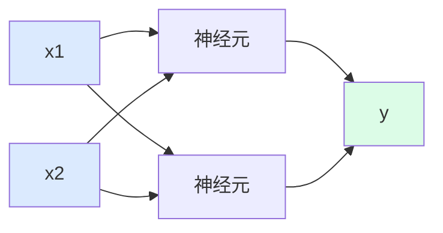
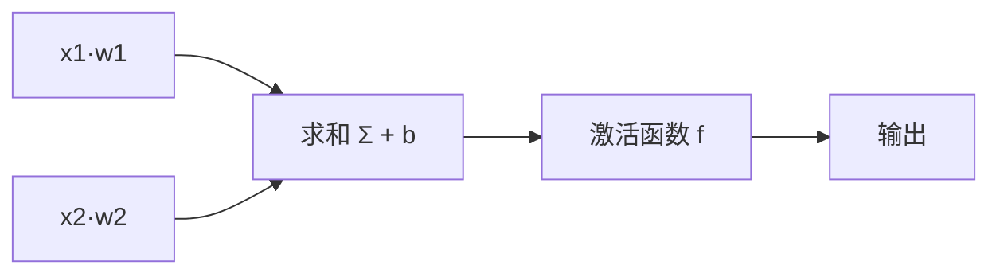
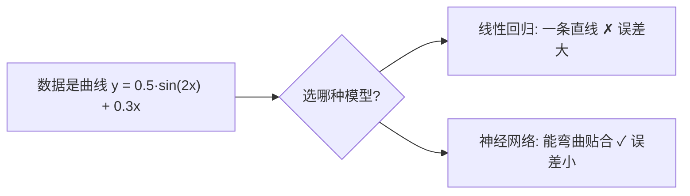

# 第15讲 · 神经网络原理与 BP 非线性拟合

Python应用程序设计(B) · 七、Python机器学习入门

---

# 学习目标

学完本节后，你能够：

- 说明神经网络的基本结构（输入层-隐藏层-输出层、神经元、激活函数）
- 用一句话描述前向传播与 BP（误差反向传播）的思想
- 用 numpy / sklearn 实现非线性拟合，并与线性回归对比
- 分析隐藏神经元数、学习率、激活函数对拟合效果的影响
- 思考人脸识别背后的隐私与安全问题

---

# 开场：你被"刷脸"过吗？

> "手机解锁、闸机、支付……你用过哪些人脸识别？它怎么认出你？"

讨论：

- 人脸识别背后其实是一个**神经网络**在做判断
- 识别越准 → 采集的人脸数据越多 → **隐私风险越大**

⭐ 本讲思政主线：技术越强大，越要守护自己的隐私与安全

---

# 神经网络到底是什么？

一句话：**神经网络 = 搭积木式地把很多简单"神经元"连起来，从数据里学出模式。**

用到的三个关键词：

- 一组输入数据（特征）
- 一组可调节的参数（权重 + 偏置）
- 一个非线性变换（激活函数）

就像一堆乐高积木——基本块都很简单，拼在一起就能搭出复杂结构。

---

# 神经网络的基本结构



- **输入层**：接收特征数据 🟦
- **隐藏层**：中间层，负责"加工/抽取特征"（课次16将深入多隐层）
- **输出层**：给出结果 🟩

本讲示例：**1 → 16 → 1**（1个输入、16个隐藏神经元、1个输出）

---

# 一个"神经元"做什么？

一个神经元 = 加权求和 + 偏置 + 激活函数



- **权重 w**：这条连接"有多重要"（可学习）
- **偏置 b**：偏移量，让模型更灵活（可学习）
- **激活函数 f**：加一点"非线性"，如 `ReLU(z)=max(0,z)`、`tanh`

> 为什么必须要有非线性激活？——全是线性的话，再多层也等于一层，无法拟合曲线。

---

# 前向传播：信号从输入传到输出

数据像"接力棒"一样从前往后传：

1. 输入 `x` 进入输入层
2. 隐藏层：`z = Σ w·x + b`，再经过 `a = f(z)`
3. 输出层：得到预测值 `y_pred`
4. 与真实值 `y` 对比，算出**误差（损失）**

```python
# 一个隐藏层神经元的计算直觉
z = x * w1 + b1          # 加权求和 + 偏置
a = tanh(z)              # 激活函数引入非线性
y_pred = a * w2 + b2     # 传到输出层
```

---

# BP：误差反向传播（一句话思想）

什么是 BP？

> **"算出误差后，把它从输出端倒着往回一层层传回去——谁贡献的误差多，就多调整谁的权重。"**

类比：**传话游戏 / 小组任务分责任**

- 结果错了 → 从最后一位开始往回找原因
- 每一层承担自己的那份"责任"，据此微调自己的权重和偏置
- 反复"前向算误差 → 反向调权重"，让误差一点点变小

> ⚠️ 本讲只讲直觉、**不推链式法则公式**。真正要会的是"前向 + 回传 + 更新"这段循环写进代码。

---

# 一个完整的学习循环（BP 全流程）

1. **前向传播**：输入 → 得预测 → 算损失
2. **反向传播**：误差从输出往回传，求各权重该改多少
3. **权重更新**：`w = w - 学习率 × 梯度`
4. **重复**：直到损失足够小

```python
for epoch in range(5000):          # 反复训练 5000 轮
    y_pred = net.forward(X)         # 1 前向
    loss = mean((y_pred - y)**2)    # 算损失（均方误差）
    net.backward(X, y)              # 2 反向播误差
    net.update(lr=0.001)            # 3 更新权重
```

---

# 为什么线性方法"学不动"曲线？

- **线性回归**：只能画一条直线，拟合不了波浪形的曲线
- **神经网络**：靠激活函数的"非线性"，可以拼出任意形状的曲线



> 本讲演示要证明的，正是这张图。

---

# 演示（Live Coding）：用神经网络拟合非线性函数

先造一批"曲线状"数据：

```python
import numpy as np, matplotlib.pyplot as plt
u = np.linspace(-2, 2, 200)
y_true = 0.5*np.sin(2*u) + 0.3*u        # 非线性目标函数
```

- 目标：让模型学会这条曲线
- 对比：线性回归（一条直线）vs 神经网络（能弯曲）
- 观察：各自误差大小、以及**损失曲线**是否一路下降

---

# 演示代码：1-16-1 神经网络（numpy 手写）

```python
class MLP:  # 3层网络 1->16->1
    def __init__(self, n_hidden=16, lr=0.001):
        self.w1 = np.random.randn(1, n_hidden)*np.sqrt(2.0)
        self.b1 = np.zeros((1, n_hidden))
        self.w2 = np.random.randn(n_hidden, 1)*np.sqrt(2.0/n_hidden)
        self.b2 = np.zeros((1, 1))
        self.lr = lr
    def forward(self, X):
        z1 = X @ self.w1 + self.b1
        self.a1 = np.tanh(z1)                # 激活函数
        return self.a1 @ self.w2 + self.b2   # 输出层
    def backward(self, X, y):
        y_pred = self.forward(X)
        dz2 = y_pred - y                     # 输出误差
        # —— 误差反向传播 + 梯度下降更新权重 ——
        self.w2 -= self.lr * (self.a1.T @ dz2)
        self.b2 -= self.lr * dz2.sum(axis=0)
        dz1 = (dz2 @ self.w2.T) * (1 - self.a1**2)
        self.w1 -= self.lr * (X.T @ dz1)
        self.b1 -= self.lr * dz1.sum(axis=0)
        return y_pred
```

训练 5000 轮后，误差远小于线性回归。

---

# 结果：神经网络 vs 线性回归

| 模型 | 最终均方误差 |
|---|---|
| 线性回归（一条直线） | ≈ 0.34 |
| 神经网络（1-16-1） | ≈ 0.001 |

- 神经网络误差小 **200 多倍** → 说明它真的"学会"了曲线而不是画直线
- 查看损失曲线：一路下降 → 训练有效；如果震荡或 `nan` → 学习率太大

> 🤔 想调整"弯曲能力"？改隐藏神经元个数；想调收敛快慢？改学习率。

---

# 故意踩坑：学会看报错

```python
loss 变成 nan        # 大概率是学习率太大，权重更新冲出边界
Array shape (200,1) 与 (1,16) 求和出错   # 矩阵维度不匹配
No module named sklearn                  # 改用 numpy 手写版兜底
```

- **学习率 0.01+ 容易发散**，本讲统一用 `0.001`
- 记住：**一次只调一个参数，控制变量**

---

# 实验任务

- 🔵 基础任务：跑通非线性拟合代码，记录损失，证明"优于线性回归"
- 🟡 进阶任务：改隐藏神经元数（如 2 vs 16）或学习率（0.01 vs 0.001）做对比
- 🔴 挑战任务：把 `tanh` 换成 `ReLU` 再拟合；并为"人脸识别隐私"写 2 条保护建议

提交要求：代码 + 关键运行结果 + 一句对比结论

---

# 思考点

1. 为什么线性回归拟合不了曲线，而神经网络能？
2. 学习率过大会怎样？隐藏神经元太少会怎样？
3. 如果今天你用自己照片做了人脸识别 demo，你会怎么保护这份数据？

---

# 思政升华：人脸识别的两面

- **好的一面**：安防、支付、便捷解锁
- **风险一面**：人脸数据不可更改（不像密码能改）、可能被滥用/泄露

你作为工程师可以做的：

- 收集前**明确告知 + 征得同意**
- 只采集识别必需的**最小数据**，加密存储
- 遵守《个人信息保护法》，及时销毁不再需要的样本

> 技术越强大，越要跑在安全和伦理的轨道上。

---

# 小结 + 预告

- 本课要点：神经网络三结构要素、前向传播、BP 反向调权、非线性拟合演示
- 下次课（课次16）：**多层神经网络与更多机器学习模型**（隐藏层加深、模型对比）
- 预习：回忆分类问题；思考"分类 与 回归 有什么不同"

> 记住 BP 一句话：**误差倒着往回传，谁错得多谁改得多。**