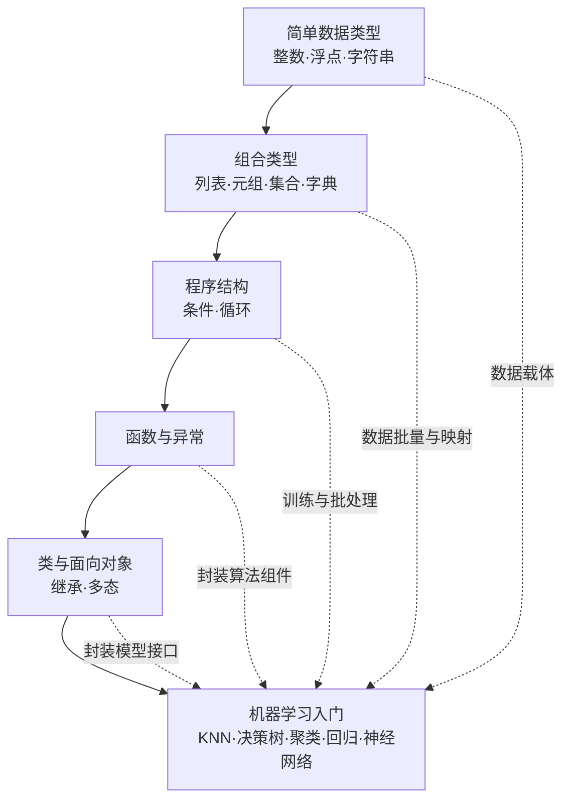
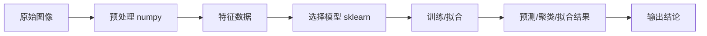

# 第16讲 · 布置课程设计要求 + 总复习

Python应用程序设计(B) · 期末

---

# 教学目标

学完本节后，你能够：

- 串讲全课程的语法主干与机器学习线索，形成自己的知识图谱
- 理解期末课程设计的全部要求：题材、选题、质量、报告、诚信、评分、时间线
- 组建"图像读取 → 预处理 → 特征/模型 → 输出"的课程设计最小流水线骨架
- 完成初步选题，明确后续各环节与提交方式

---

# 开场：你本学期的成绩怎么来？

| 构成 | 占比 | 方式 |
|---|---|---|
| 出勤 | 10% | 考勤点名 |
| 平时 | 30% | 课堂小测、课后作业、平时表现 |
| **期末课程设计** | **60%** | 完成一个基于 Python 的智能图像处理项目 |

> 期末占大头、是综合应用。这节课把「怎么交」讲清楚 + 把「会什么」串起来。

---

# 总复习 · 一图看全课



---

# 复习线索一：简单数据类型

- **整数 int**：数值运算、模型训练迭代计数
- **浮点 float**：神经网络权重、回归系数
- **字符串 str**：定义、分片（正片/负片逆序）、常见方法（`strip`/`split`/格式化）
- **输入输出**：`input()`（注意返回的是字符串，要转换！）与 `print()`
- **类型转换**：`int(x)` / `float(x)` / `str(x)` — AI 数据预处理的起点

> 记忆点：**分片 `s[::-1]` 逆序**、**input 得到字符串要转换**。

---

# 复习线索二：组合类型

| 类型 | 特征 | 常用操作 | 项目里的角色 |
|---|---|---|---|
| 列表 list | 有序、可变 | `append/sort/遍历` | 批量存图像样本、损失值序列 |
| 元组 tuple | 有序、不可变 | 下标访问、解包 | 返回多值、坐标(`(x,y)`)、(h,w) |
| 集合 set | 无序、元素唯一 | `去重/交并差` | 标签去重、样本去重 |
| 字典 dict | 键值映射 | `d[k]`、遍历 | 配置参数映射、词频统计、标签字典 |

> 记忆点：**列表可变、元组不可变；集合去重；字典靠 key 映射**。

---

# 复习线索三：程序结构

- **条件分支**：`if / elif / else`，多分支的隐含条件
- **循环**：`for`（遍历）与 `while`（按条件），`break` / `continue` 控制流程
- **嵌套结构**：循环套循环、条件套循环一一对应

```python
# 读取一批图像路径并过滤（范例骨架）
for path in image_paths:
    if is_valid(path):          # 条件过滤
        data.append(load(path)) # 收集数据
        if len(data) >= limit:  # 控制流程
            break
```

> 记忆点：**循环是批处理的核心逻辑**，模型训练就是宏大的 for 循环。

---

# 复习线索四：函数与异常

- **函数定义与调用**：`def f(...)`，局部 vs 全局变量
- **参数类型**：位置/关键字/默认值，可变参数与不可变参数的区别
- **匿名函数**：`lambda x: x+1` — 短小、临时、就地用
- **内置函数**：`len/sorted/map/filter/max/min/sum`
- **异常处理**：`try/except/finally` — 让程序更健壮的必备技能

```python
try:
    img = load_image("photo.png")
except FileNotFoundError as e:
    print("图像不存在，请检查路径")
finally:
    print("资源处理完成")
```

> 记忆点：**模块化靠函数、健壮性靠异常**。

---

# 复习线索五：类与面向对象

- **类的定义与调用**：`class 名:` 构造器 `__init__`、属性、方法
- **实例属性 vs 类属性**：每个实例独立私有数据 / 类共享通用框架
- **继承**：子类继承父类的属性和方法，可扩展、可覆盖
- **多态**：同一接口，不同对象行为不同
- **公有 vs 私有**：以 `_` 开头表示私有，控制封装

```python
class ImageClassifier:
    def __init__(self, model):      # 构造器：存模型
        self.model = model
    def train(self, X, y):          # 公有方法：训练
        self.model.fit(X, y)
    def predict(self, X):           # 公有方法：预测
        return self.model.predict(X)
```

> 记忆点：**用类把"读图→预处理→建模→预测"封装成可复用接口**。

---

# 复习线索六：机器学习，从数据到决策



- **监督学习（有标签）**：KNN 分类、决策树分类、线性回归（连续值）
- **无监督学习（无标签）**：k-means 聚类
- **神经网络**：BP 算法实现非线性拟合

---

# 算法速辨

| 问题 | 有无标签 | 预测目标 | 算法 |
|---|---|---|---|
| 判断图片是猫还是狗 | 有 | 类别 | KNN / 决策树 |
| 预测房价、温湿度连续值 | 有 | 数值 | 线性回归 |
| 给无标签图片自动分组 | 无 | 组别 | k-means |
| 拟合复杂的非线性关系 | 有 | 数值/类别 | 神经网络 BP |

> 两问辨算法：**有没有标签？要预测的是类别还是数值？**

---

# 最小课程设计流水线（演示）

```python
import numpy as np
from sklearn.neighbors import KNeighborsClassifier

# 1. 读入并预处理特征矩阵 X、标签 y（numpy)
X = np.random.rand(50, 4)   # 示意：50 个样本，4 个特征
y = np.array([0, 1] * 25)   # 示意：两类标签

# 2. 拆分训练/测试
from sklearn.model_selection import train_test_split
Xtr, Xte, ytr, yte = train_test_split(X, y, test_size=0.2)

# 3. 训练与评估
knn = KNeighborsClassifier(n_neighbors=3)
knn.fit(Xtr, ytr)                 # 训练
acc = knn.score(Xte, yte)         # 评估
print("准确率:", acc)
```

> 课程设计 = 把这个骨架换成"真实图像 + 你的主题 + 一个合适的模型"，并把它做完整。

---

# 期末课程设计 · 题材形式

**完成一个基于 Python 的智能图像处理项目。**

- 用 numpy / scikit-learn / opencv-python（可选）完成图像读取、预处理、特征/建模、结果输出
- 体现"从底层语法到机器学习应用"的完整能力

---

# 期末课程设计 · 作品主题

选取一个具有**创新性**或**实际意义**的主题，例如：

- 🔵 应用型：图像边缘检测、灰度直方图均衡、图像去噪、亮度/对比度增强
- 🟡 进阶型：用 KNN/决策树做手写数字、简单物体分类；图像颜色统计
- 🔴 创新型：结合专业——光电/通信/电气场景的智能图像应用（鼓励创意）

> 选题需"功能完整 + 具备一定工作量"，避免过简。

---

# 期末课程设计 · 作品质量要求

- **功能完整**：选项处理、处理、输出闭环
- **不宜太过简单**：建议至少覆盖「预处理 + 一个模型」两段
- **具备一定工作量**：能体现一学期的综合运用，而不是 10 分钟 demo
- **代码规范**：可读、有注释、模块清晰

> 提供的难度检查清单：能否说清"你做了什么、用了哪些第几讲的知识、为什么要这么做"？说不清 → 太重或太简。

---

# 期末课程设计 · 作品报告

- 报告内容应**完整**、**语言顺畅**
- 按照**参考模板**撰写（课后发放《课程设计报告模板》）
- 建议章节：题目与背景 → 需求分析 → 技术方案 → 实现过程 → 结果展示 → 总结反思

---

# 期末课程设计 · 诚信要求 + 评分

**诚信要求（红线）：**
> 个人独立完成；发现抄袭或基本雷同者视为 **0 分**。

**评分标准：**
- 详见学期末发布的考核标准；总体看重「题材 + 主题 + 质量 + 报告」四维综合表现
- 评分更偏向"你在完成度与工作量上真实的投入"

---

# 时间线与提交方式

| 项目 | 内容 |
|---|---|
| 选题 | 本讲课后 1 周内，提交一页《选题说明表》 |
| 开发 | 课后至截止日前自主完成，可答疑 |
| 答辩/点评 | 期末周按安排进行（如有） |
| 报告+代码 | 按公告提交平台命名约定打包提交 |
| 答疑渠道 | 课程群 + 答疑时间 |

> 具体日期以平台通知为准，提交前务必对照要求自查清单。

---

# 课堂复习快测（3 分钟，试答）

1. `s[::-1]` 对一个字符串做了什么？
2. 列表与元组最本质的区别是什么？
3. `input()` 读到的数据是什么类型？要当数字用怎么办？
4. KNN(K近邻) 与 K-means(K均值) 本质区别是什么？

> 答案在课上揭晓，也可课后对照讲义自查。卡住的知识点 → 记入你的"疑问清单"。

---

# 思考点（本讲）

1. 你会选什么主题做课程设计？为什么它有实际意义？
2. 课程设计里，你会用到我们学过的哪几个"语法主干 + 算法"？画一张你的项目流程图。
3. 回顾 16 讲，哪一条"语法 → 应用"的路径让你最有成就感？

---

# 小结 + 后续安排

- 本课完成两件事：**课程设计要求全部传达** + **全课程双线索总复习**
- 你要做的：1 周内填《选题说明表》提交；自主开发；按时提交报告与代码
- 下次课：答疑 / 机动（选题与实现问题集中处理）

> 把期末课程设计当作这 16 讲的"毕业作品"，用你学到的 Python 与机器学习，去解决一个真实的小问题。祝你们顺利收官！