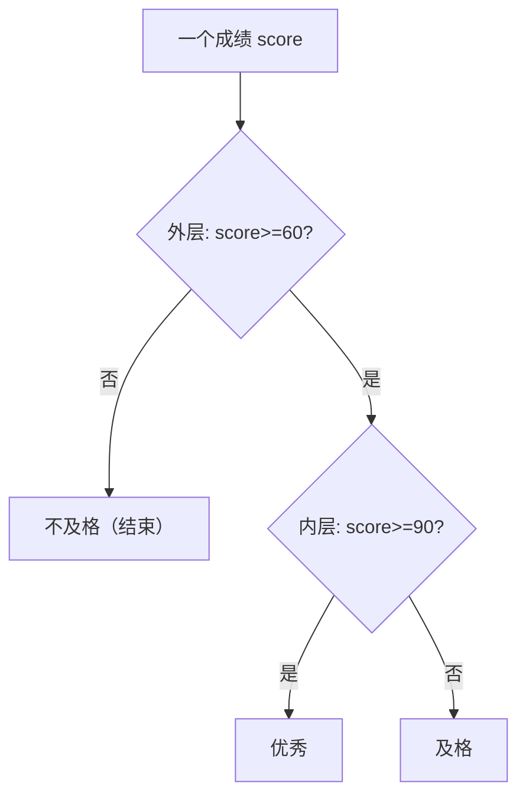

## 学习目标

学完本节后，你能够：

- 写出单条件、双条件、多条件三种分支程序
- 用 `elif` 处理多分支，并理解其**隐含条件**
- 正确使用缩进组织嵌套分支
- 独立完成"比大小""成绩等级判定"两个实验

---

## 开场提问

> "你已经会写 C 的 if/else 了——Python 里它俩最大的差别是什么？"

提示：不是关键字，而是**它俩**……

想一下：C 用什么界定代码块？Python 呢？

（答案留给你：一个是 `{}`，一个是缩进）

---

## 语法快带过：三种分支（1）

**单条件分支 `if`**

```python
age = 20
if age >= 18:
    print("成年")      # 缩进的这行属于 if 块
```

**双条件分支 `if-else`**

```python
n = -5
if n >= 0:
    print("非负数")
else:                # else 条件 = if 不成立，不用再写判断
    print("负数")
```

---

## 语法快带过：三种分支（2）

**多条件分支 `if-elif-else`**

```python
score = 85
if score >= 90:
    grade = "优秀"
elif score >= 80:
    grade = "良好"
elif score >= 70:
    grade = "中等"
elif score >= 60:
    grade = "及格"
else:
    grade = "不及格"
print(grade)      # 输出：良好
```

- 从上到下**依次判断**，命中第一个成立的分支即停止
- 关键字是 `elif`，不是 `else if`

---

## 缩进 = 代码块 ⭐

C 用 `{}` 界定块，Python 用**缩进**。

```
if 条件:
    缩进的语句 ……  # 属于 if 块
    缩进的语句 ……  # 仍属于 if 块
不缩进的语句 ……     # 已离开 if 块
```

- 块内统一 4 个空格（不要混用 Tab）
- 缩进错了 → `IndentationError`，或**逻辑错位**（不报错但结果错误，更危险）

---

## 为什么强调嵌套规则 ⭐

真实选择往往不止一层。**层次怎么定？**

> 原则：外层抓"大类"，内层做"细分"。



---

## 嵌套分支写法（重点⭐）

外层判断"是否及格"，内层再细分等级：

```python
score = 88
if score >= 60:            # 外层：抓大类
    if score >= 90:        #   内层：细分
        grade = "优秀"
    elif score >= 80:
        grade = "良好"
    else:
        grade = "及格"
else:
    grade = "不及格"
print(grade)     # 输出：良好
```

**层次顺序：** 先定外层大条件，再逐层往内细化条件，每层缩进 +4 空格。

---

## 难点：elif 的隐含条件 ⚠️（1）

**误区：把每个 elif 当独立 if，重复判断前置条件**

```python
score = 85
if score >= 90:
    grade = "优秀"
elif score >= 60 and score < 90:   # ❌ 多写了 score >= 60
    grade = "及格"
```

预期 85 → "及格"，实际正确吗？——**逻辑能对，但写法冗余、易错**。

---

## 难点：elif 的隐含条件 ⚠️（2）

**正解：自 `if` 之后，逐层 `elif` 已隐含"前面都不成立"**

```python
if score >= 90:
    grade = "优秀"
elif score >= 80:
    grade = "良好"     # 到这里已隐含 score < 90
elif score >= 60:
    grade = "及格"     # 隐含 score < 80
else:
    grade = "不及格"   # 隐含 所有前置都不成立，即 score < 60
```

> 结论：`elif` 判断的是**本层**条件，不必也无须叠加写前置条件——这是它省代码、清爽的原因。

---

## 常见错误

| 错误 | 原因 | 正确做法 |
|---|---|---|
| `IndentationError` | Tab/空格混用、层级错乱 | 统一 4 空格缩进 |
| 逻辑错位不报错 | 该缩进的行没缩进，掉出 if 块 | 检查缩进层级 |
| `elif` 重复判断前置条件 | 把 elif 当独立 if | 直接写本层条件，依赖隐含条件 |
| 用 `else if` 而非 `elif` | 套用 C 语法 | Python 用 `elif` |
| 边界 `>=` vs `>` 用错 | 未考虑等于情况 | 设计测试用例验证两端取值 |

---

## 实验任务

本讲实验通过 **Hydro 在线题 P0601–P0605** 自动验收，详见 `hw06` 作业：

- 🔵 基础任务：正负与奇偶判断、成绩等级判定、三数比大小（P0601–P0603，无输入固定输出）
- 🟡 进阶任务：比大小、成绩等级自动判定——`input()` 读入 + 条件分支综合（P0604、P0605）
- 🔴 挑战任务：三数比大小 / 成绩等级的多写法对比，理解 `elif` 隐含条件

提交要求：三个典型测试用例的运行截图 + 关键代码

---

## 思考点

> 如果条件很复杂，需要嵌套条件，应该**如何按照层次编写**？

1. 嵌套的先做什么、后做什么？外层管什么？
2. 什么时候用嵌套，什么时候用 `elif` 并列？
3. 写嵌套代码时，如何防止缩进层数失控？

---

## 小结 + 预告

- 本课要点：
  - `if` / `if-else` / `if-elif-else` 三种分支
  - 缩进 = 代码块
  - 嵌套分层（外层抓大类、内层细分）
  - `elif` 隐含条件
- 下次课：**循环结构**（for / while）
- 作业：预习循环结构；完成条件结构上机题（HW06）

> 判断帮你"开岔路"，下一步学习"反复走同一条路" 🧭