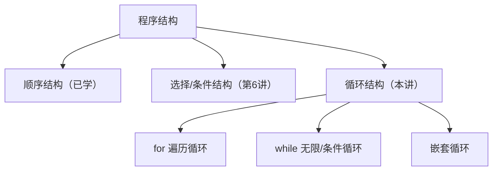
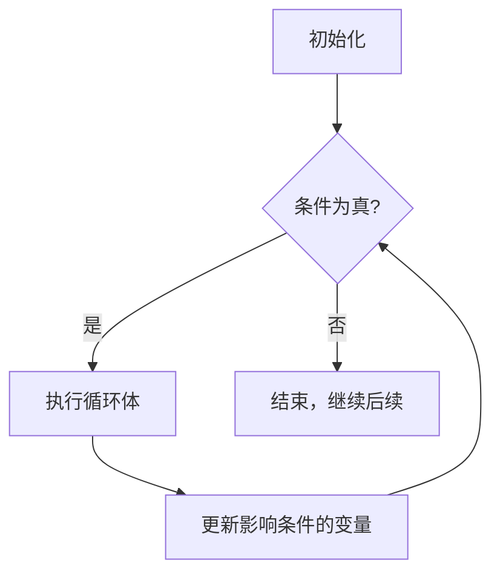
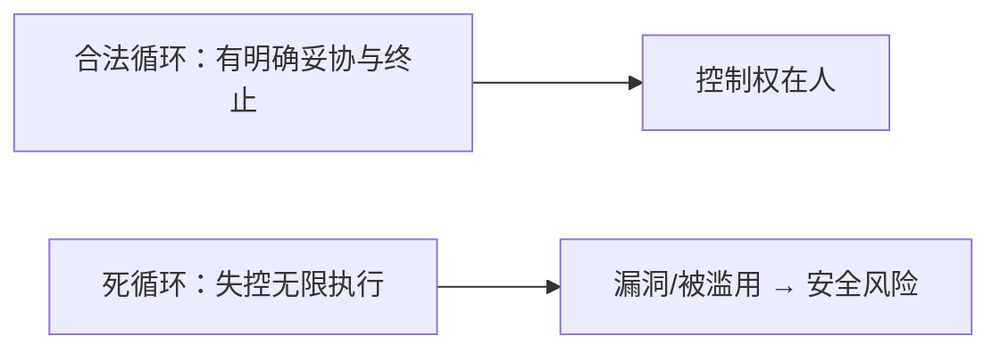

## 学习目标

学完本节后，你能够：

- 说明 for（遍历）与 while（条件/无限）两种循环的原理和终止条件
- 用 for + range() 批量处理和遍历数据
- 用 break / continue 主动控制循环流程
- 用"变量追踪表"分析嵌套循环，准确预判输出
- 认识"死循环=恶意代码"的信息安全风险

---

## 开场提问

> "要计算 1+2+3+...+100，你会怎么写？"

- 一条条 `print(1+2+3+…)`？那 1000 项、100000 项呢？
- 同样的重复劳动，在 AI 里就是"**批量遍历训练数据**"
- ⭐ **循环 = 让计算机把重复的事自动做无数遍**

---

## 循环的两种基本结构

- **遍历循环 `for`**：有一个明确的"清单"，按顺序逐个处理
- **无限/条件循环 `while`**：反复执行，直到某个"条件"不成立为止



---

## for 循环：遍历思想

语法：

```python
for 变量 in 可迭代对象:
    循环体
```

- "可迭代对象" = 能逐个取出的东西：**列表、元组、字符串、range() 生成的整数序列**

对比 C 的习惯：C 是"按下标 i 一个个取"，Python 是"直接遍历每个元素"

```python
nums = [3, 1, 4, 1, 5]
for n in nums:          # n 依次是 3,1,4,1,5
    print(n * n)        # 输出 9 1 16 1 25
```

---

## range()：批量生成整数

```python
range(5)            # 0,1,2,3,4        （差1缺尾）
range(2, 9, 2)      # 2,4,6,8          起始、终止(不含)、步长
```

用于"累加求和"这类经典场景：

```python
total = 0
for i in range(1, 101):   # 1 到 100
    total += i
print(total)              # 5050
```

> 遍历字符串同样自然：`for ch in "Python": print(ch)`

---

## while 循环：条件/无限循环

语法：

```python
while 条件:        # 只要条件为真就不断执行
    循环体
```



**循环三大要素：初值、条件、更新**

---

## while 实例：读到结束标记为止

```python
total = 0
while True:                 # 无限循环
    x = int(input("输入整数(输入-1结束)："))
    if x == -1:             # 用标记值结束
        break
    total += x
print("总和 =", total)
```

- `True` 恒为真 → 若不主动 `break`，就是"死循环"
- 这是"读数据直到结束"的标准模式

---

## ⚠️ 思政点：死循环 = 恶意代码

**死循环**：条件恒真、且无 `break` 的循环，会无限执行、占用 CPU/资源卡死程序。

类比恶意代码：

- **挖矿脚本**：挂机循环耗尽 CPU
- **勒索程序/锁机木马**：无限循环拒绝服务
- **蜂拥攻击 / 耗尽内存**：循环致资源被拖垮



> 讨论：同样一段循环，为什么"受控"是安全的，"失控"就可能变成攻击工具？——**写出能正确终止的循环，就是最基础的信息安全防护。**

---

## break：提前终止

`break`：立即**跳出整个当前层循环**（不再执行剩余迭代）

```python
for i in range(1, 7):
    if i == 5:
        break          # 到 5 就停
    print(i, end=" ")  # 1 2 3 4
```

适合：搜索"找到就停"、读输入"遇标记结束"

---

## continue：跳过本次

`continue`：**跳过本次迭代剩余语句**，立即进入下一次

```python
for i in range(1, 7):
    if i == 3:
        continue       # 跳过 3
    print(i, end=" ")  # 1 2 4 5 6
```

---

## 🤖 AI 赋能：按"损失值"动态控制训练循环

📌 模型训练的本质就是**迭代循环**，用 `break`/`continue`/条件动态调整：

```python
loss = 1.0
for epoch in range(1000):     # 遍历训练轮次
    loss = train_one_epoch(epoch)   # 假想的一轮训练
    if loss < 0.001:          # 损失降到阈值 → 提前收敛停训
        print("已收敛，提前停止")
        break
    if loss > 10:             # 损失爆炸 → 跳过/调整再继续
        continue
```

> `for` 批量遍历数据集、`break/continue` 按损失值动态调整训练流程，正是本课 AI 赋能点。

---

## 嵌套循环：循环里套循环

外层每执行**一次**，内层要执行**一整轮**

```python
for i in range(1, 5):          # 外层：行
    for j in range(1, i + 1):  # 内层：每行打印 i 个
        print("*", end="")
    print()                    # 换行
```

输出：

```
*
**
***
****
```

---

## ❗难点：嵌套循环的变量追踪表

外层变量 `i`（行号）每变一次，内层变量 `j` 都要从初值重新走一遍。盯住两件事：**外层一次、内层一轮**。

以 `for i in range(1,4):  for j in range(i):  print(i,j)` 为例：

| 外层 i | 内层 j 遍历 | 本轮输出 | 本轮循环体执行的次数 |
|---|---|---|---|
| 1 | 0 | (1,0) | 1 次 |
| 2 | 0,1 | (2,0)(2,1) | 2 次 |
| 3 | 0,1,2 | (3,0)(3,1)(3,2) | 3 次 |

> 规律：外层改一次，内层完整跑一遍。**先画追踪表，再谈输出。**

---

## 经典：九九乘法表

```python
for i in range(1, 10):            # 外层：行
    for j in range(1, i + 1):     # 内层：列，只到 i
        print(f"{j}*{i}={i*j}", end="  ")
    print()                       # 每行结束换行
```

- 外层 `i` 控制行（1~9）
- 内层 `j` 控制列（1~i），**列数由当前行 i 决定** → 构成下三角
- 改 `range` 或列范围，可得到不同形状（三角形、上三角等）

---

## 常见错误

| 错误 | 原因 | 正确做法 |
|---|---|---|
| 循环不输出 / 少一行 | `range(n)` 差 1 缺尾，把 n 当 1~n | 用 `range(1, n+1)` 或改成边界 |
| 程序"卡死不动" | `while` 忘更新变量 → 死循环 | 牢记：初值、条件、更新；`Ctrl+C` 中断 |
| 乘法表列数不对 | 分不清外层 i / 内层 j 谁该用 `i+1` | 先画变量追踪表 |
| `break` 只跳一层 | 混淆嵌套循环作用范围 | `break/continue` 只作用于当前层 |
| 想按下标取却拿值 | `for n in list` 拿的是元素不是下标 | 需下标时用 `range(len(list))` 或 `enumerate` |

---

## 实验任务

本讲实验通过 **Hydro 在线题 P0701–P0705** 自动验收，详见 `hw07` 作业：

- 🔵 基础任务：`for`+`range()` 求和、`break`/`continue` 控制流程、嵌套循环数字图案（P0701–P0703）
- 🟡 进阶任务：`while` 读入统计、质数判断——循环+条件综合（P0704、P0705 综合题用到）
- 🔴 挑战任务（AI 场景）：模型训练按损失值 `break`/`continue` 的动态控制思路

提交要求：可运行的 `.py` 源文件 + 关键运行结果

---

## 思考点

> **如何控制循环体的执行情况？**

1. 循环体什么时候"开始执行""重复几遍""何时结束"由什么决定？
2. `break` 和 `continue` 分别控制什么？有什么不同？
3. 内层循环要执行多少次，由什么决定？（对照嵌套循环）

---

## 小结 + 预告

- 本课要点：
  - **for 遍历 + range()** 批量处理、累加求和
  - **while 条件/无限循环**：初值、条件、更新三要素
  - **break / continue** 主动控制流程
  - **嵌套循环**与变量追踪表
- 下次课：**函数**（把重复逻辑封装复用）
- 预习：什么是函数、怎样定义和调用；理解"死循环为何危险"

> 能写好、能停停进进的循环，是把程序交给 AI 时代批量处理的入场券 🚪